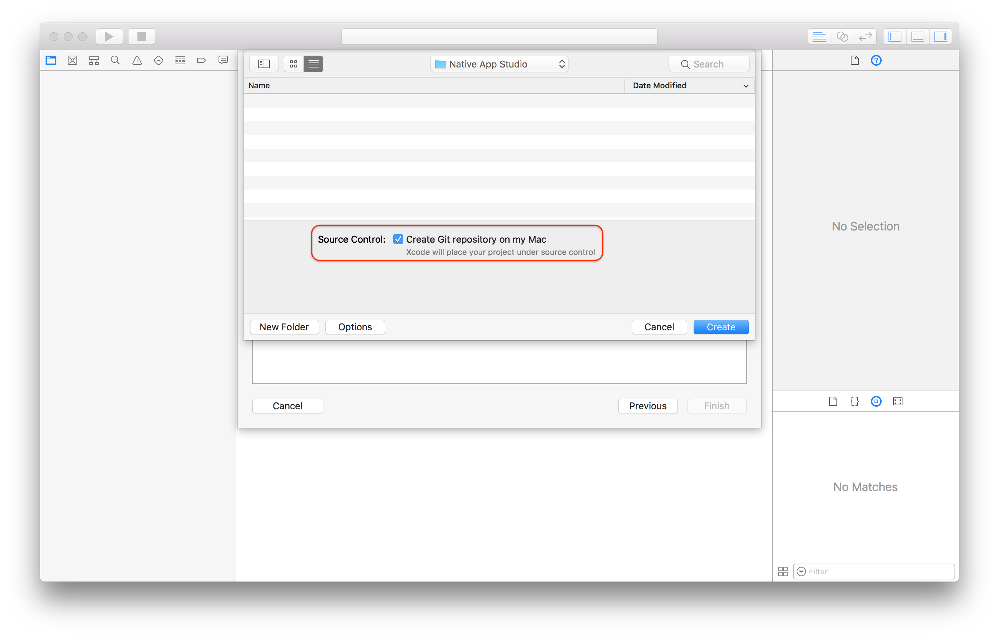
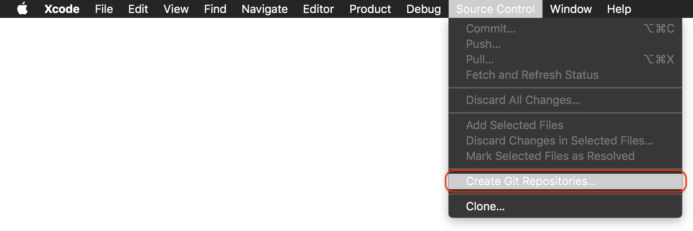
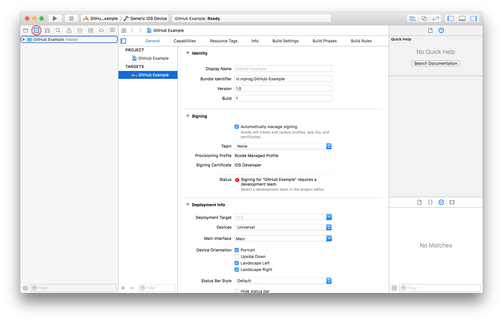

# GitHub in Xcode 9

## Preparation: Create a GitHub account
Projects you'll make in this course need to be on GitHub.
If you don't have an account, you can create one [here](https://github.com/join).

## Preparation: While creating your project

Be sure to enable "Source Control" while creating your project

If you haven't done that you can enable Source control in your menubar.

## Getting your project on GitHub

Open the "Source Control Navigator" (`⌘2`) and right-click on your project.

Choose, "Create "Project-name" Remote on GitHub".
{:style="height:50%;width:50%"}

Choose your account (or Add a GitHub account...), add a repository name, be sure your projects visibility is on public and click Create!

**Note:** A good repository name is for example `MarijnJansen-Unit1-Light`

We also made a short video instructing you how to create a new project in Xcode with Git and GitHub.

