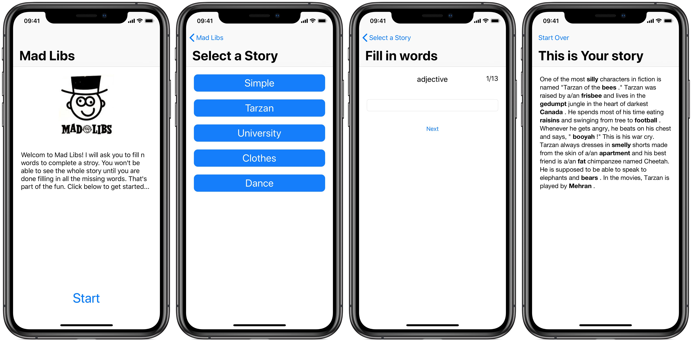

# Madlibs

## Background

“Mad Libs” are short stories that have blanks called placeholders to be filled in. In the non-computerized version of this game, you ask someone to fill in each of the placeholders without telling them anything about the overall story. Once all placeholders are filled in, you show them the resulting silly story.

The screenshots below indicate a possible flow of the UI for an app that implements this game. It has four screens: a “welcome” screen explaining the app, then a screen where the user can chose a story, then a screen that repeatedly prompts the user to fill in placeholders. Once the user has typed in replacements for all these placeholders, the completed story is shown on the final screen. Of course you don’t need to exactly match our sample’s UI, but it may give you ideas.



The text files represent placeholders as tokens that start and end with `< >` brackets, like `<adjective>` or `<proper-noun>`. Here is the text of `madlib1_tarzan.txt`, to give you an idea of the Mad Lib format:

```
One of the most <adjective> characters in fiction is named "Tarzan of the
<plural-noun> ." Tarzan was raised by a/an <noun> and lives in the
<adjective> jungle in the heart of darkest <place> . He spends most of his
time eating <plural-noun> and swinging from tree to <noun> . Whenever he
gets angry, he beats on his chest and says, " <funny-noise> !" This is his
war cry. Tarzan always dresses in <adjective> shorts made from the skin of
a/an <noun> and his best friend is a/an <adjective> chimpanzee named
Cheetah. He is supposed to be able to speak to elephants and <plural-noun>
. In the movies, Tarzan is played by <person's-name> .
```

The code for reading the story text file, breaking it apart, looking for the placeholders, etc. is not part of the assignment. To make the assignment more manageable, we’ll give you a file (see below) that you should use as a building block. If you add the `Story` class to your project, you can construct a `Story` object and it will read the text data from that source, break the text apart, and find the placeholders for you, etc. The `Story` class has other methods for filling in the placeholders later. By using this helper object, you can focus more on the important parts of this assignment and less on the string processing parts.

## Download Project Files

You can download these files [here](madlibs_ios.zip)

## Requirements

Your task is to build an app according to the description above. On top of that, there are some specific requirements to take into account:

- Your app should be built using the `Story` class.

- The user should be allowed to  either pick one of the stories, or have it randomly selected.

- Your app should properly display on devices of various dimensions.

- Your app should properly support rotation of the user interface.

- Your app should provide proper back navigation. In this case, when showing the final story, going "back" should immediately return to the start screen, instead of allowing to change words etc. In the concept of the game it makes no sense to be able to change the words.

## FAQ

Notting yet.

## Goals

Our main goal for this course is getting you some in-depth experience on important aspects of creating **good quality** apps. You'll practice with various techniques every week. For this week, make sure you try, as much as possible, to create an app that excels in these respects:

- layout, margins, compatibility with multiple tablet sizes
- basic code quality such as comments, names, consistency and design
- easy to use, no odds and ends


## Adding to GitHub

[Here](https://apps.mprog.nl/ios-reference/github) you'll find several instructions for adding your project's code to GitHub.


## Grading

*Before* the deadline, complete the exercises and put your finished project on GitHub. Ask for help if needed!

1. Submit the link to your project's GitHub repository at [Week 4](/submit/unit-4).

2. On (or before) the date of the deadline, show the working app to one of the staff.

3. Next, acquire feedback on your app and improve on it. Improvements should be finished and synced with GitHub before the course's final deadline.
