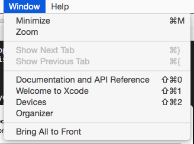
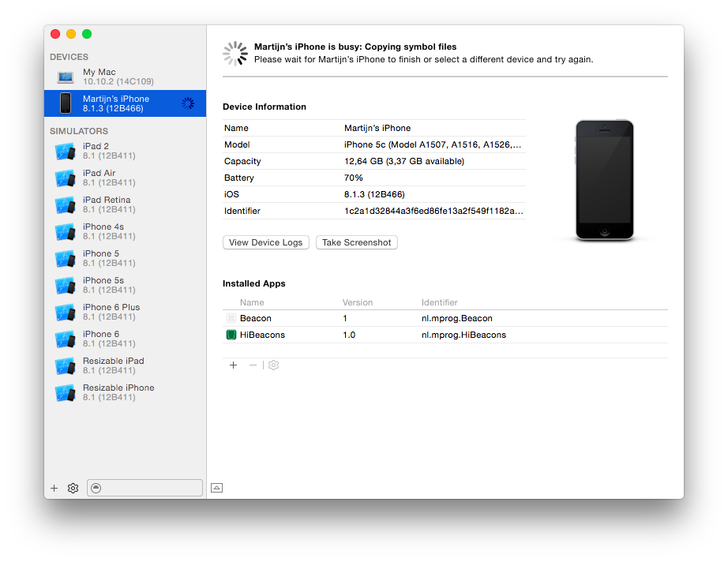
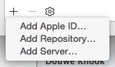
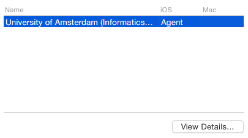
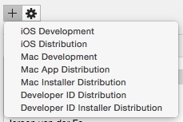
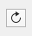
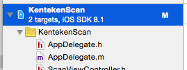
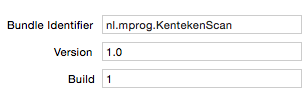

# Testing on iOS

You can (and must!) test your own apps on an iPhone or iPad, through the Apple
Developer University Program. This is free of charge. It will, however, cost you some time!

## Apple ID

If you do not have an Apple ID, or you have forgotten your password, head to
<https://appleid.apple.com> where help awaits.

## Retrieving your UDID

Every iOS device has a unique device ID that Apple uses to track testing
devices. To be able to use *your* device for testing, its *UDID* has to be
registered with Apple. Go to the *Devices* window in Xcode:

Then, plug in your device and select it in the leftmost pane of that window.
Now, you will find your *UDID* under the *identifier*, er... identifier:

## Developer registration

The registration as a developer must be done by the course's instructor, so
send an e-mail containing your *Apple ID* and your phones *UDID* to
<help@mprog.nl>.

## Accepting the invitation

Probably after a couple of hours, you will receive an invitation from Apple
Developer. You will need to *accept* this invitation before anything else.

## Adding the account to Xcode

You can now head to Xcode's preferences window:

And there you can *add* your Apple ID to Xcode:

If all goes well, you will then see the University account in the list on the right, where you can click *View Details* to proceed:

## Requesting a certificate

Now, you need to request a certificate that uniquely identifies the computer you will be developing on. Choose *iOS Development* in this menu:

## Loading the provisioning profile

Only *after* the certificate has been generated, you can get your provisioning profile by clicking the *refresh* button. Accepting the certificate is done by hand, so it will take a while before a profile with your name appears in the window below.

## Setting your app's bundle identifier

Your provisioning profile will be linked to the `nl.mprog` company identifier. You app's bundle ID therefore must start with this same identifier. Go to your project in the navigation drawer:

And then change the bundle identifier if needed:

