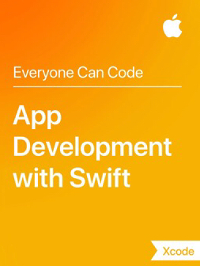

# Getting started with app development

Get started using Swift, a brand new language for developing apps on iOS. Get to know Playgrounds, a great place to explore using Swift! Also, build your very first app.

In some respects, Swift is a bit different from most programming languages. The lessons offer to learn everything from the ground up. Feel free to skip some of the parts about the programming language, but make sure that you know exactly how to write correct Swift code!

## 0. Getting the book

For all units, you will work on the book "App Development with Swift", which you can get for free in the iBooks Store. iBooks should be available on your Mac or on your iPad---but if it isn't, simply download it from the App Store.

## 1. Introduction to Swift and Playgrounds

- Know how to use the interactive Swift REPL on the Terminal
- Know how to create a new Playground in Xcode and how to output stuff

## 2. Constants, variables and data types

- Know how to declare variables and constants
- Know how to specify a variable type
- Know how to declare a variable without specifiying the type explicitly
- Know about the Swift conventions for naming variables and constants

## 3. Operators

- Know how to write expressions
- Know how to convert numeric types

## 4. Control flow

- Know how to write if-else if-else statements
- Know how to write switch statements
- Know how to specify number ranges
- Know how to use the ternary operator

## 5. Xcode

- Know how to create a new iOS project
- Know a couple of shortcuts

## 6. Building, running and debugging an app

- Know how to get an app running on your own iOS device
- Know how to deal with some of the warnings and errors you may get
- Know how to step through code using the debugger

This lesson contains a "debug your first app" lab. You must complete the lab and show that you have done so!

**Demonstrate:** Debug your first app

## 7. Documentation

- Know how to look up documentation using the Quick Help feature
- Know how to read further documentation in the help browser

**Demonstrate:** Use documentation ("What is a view's frame?")

## 8. Interface Builder basics ##

- Know where to find some of the inspectors like the "Attributes" inspector
- Know how to create outlets and actions using the Assistant Editor

**Demonstrate:** Use interface builder

## Guided Project: Light ##

**Demonstrate:** the complete and working app

