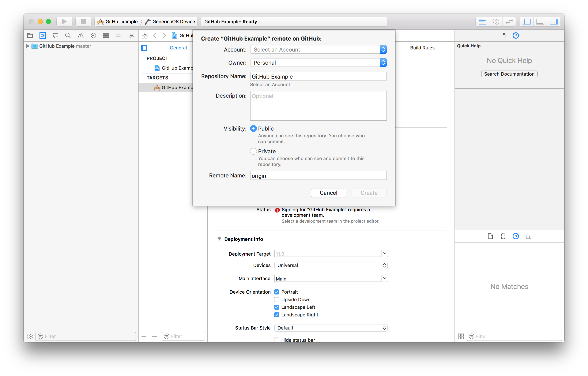
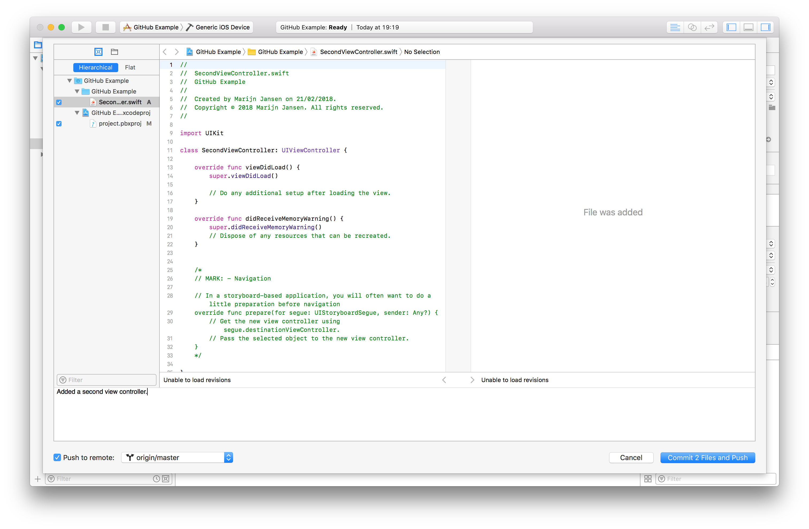

# GitHub in Xcode 10

### Preparation: Create a GitHub account

Projects you'll make in this course need to be on GitHub.
If you don't have an account, you can create one [here](https://github.com/join).

### Preparation: While creating your project

Be sure to enable "Source Control" while creating your project

If you haven't done that you can enable Source control in your menubar.

### Getting your project on GitHub for the first time

Open the "Source Control Navigator" (`⌘2`) and right-click on your project.

Choose, "Create "Project-name" Remote...".
{:style="height:50%;width:50%"}

Choose your account (or Add a GitHub account...), add a repository name, be sure your projects visibility is on public and click Create!

Your project is now on GitHub in it's inital state.

**Note:** A good repository name is for example `MarijnJansen-Unit1-Light`

## Commiting you changes 

When you're ready to commit your changes to GitHub, click 'Source Control' in the menubar and then 'Commit...' (`⌥⌘C`).
Make sure you'll check the 'Push to remote'-checkbox.

