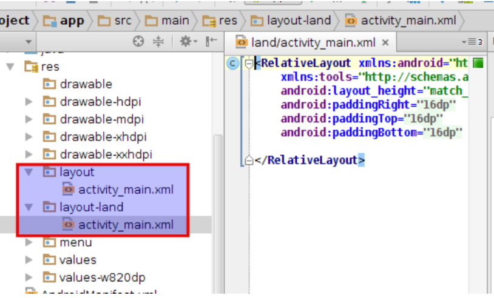

# Layouts

<iframe src="https://player.vimeo.com/video/211268580" width="320" height="200" frameborder="0" webkitallowfullscreen mozallowfullscreen allowfullscreen></iframe>

## Tutorials to get you started

- Read all about [layouts](https://developer.android.com/guide/topics/ui/declaring-layout.html) on the Android website.

- This [Android Basic Layout](http://www.journaldev.com/9495/android-layout-linearlayout-relativelayout-example-tutorial) tutorial covers all basic types of layout and offers you some sample code to experiment with. Try to fully understand what you are using, don't just blindly copy the contents!

## Types of layouts

- `LinearLayout` for easily creating almost any layout ([documentation](https://developer.android.com/training/constraint-layout/index.html)). However, calculating the position of controls using linear layouts tends to slow your app down when there are too many of them in one screen.
- `ConstraintLayout` uses rules to position controls on the screen ([documentation](https://developer.android.com/training/constraint-layout/index.html)). This is the layout that comes with new Android Studio projects and is promoted in the documentation as a modern alternative for other layouts managers.
- `FrameLayout` for stacking many controls on top of each other ([documentation](https://developer.android.com/reference/android/widget/FrameLayout.html)). This type of layout is not used very often, but can come in handy in some situations.

## Creating layouts for Android apps

Create XML resource files.

    <?xml version="1.0" encoding="utf-8"?>
    <LinearLayout xmlns:android="http://schemas.android.com/apk/res/android"
                  android:layout_width="match_parent"
                  android:layout_height="match_parent"
                  android:orientation="vertical" >
        <TextView android:id="@+id/text"
                  android:layout_width="wrap_content"
                  android:layout_height="wrap_content"
                  android:text="Hello, I am a TextView" />
        <Button android:id="@+id/button"
                android:layout_width="wrap_content"
                android:layout_height="wrap_content"
                android:text="Hello, I am a Button" />
    </LinearLayout>

Load the layout when the screen is displayed.

    public void onCreate(Bundle savedInstanceState) {
        super.onCreate(savedInstanceState);
        setContentView(R.layout.main_layout);
    }

## Situational layouts

Your app can use different layouts in different situations:

- different device type (tablet vs phone vs watch)
- different screen size
- different orientation (portrait vs. landscape)
- different country or locale (language, etc.)

For example, to create a different layout in landscape mode, you can add a new layout XML file:

- create a folder in your project called `res/layout-land`
- place a copy of your activity's layout XML file there
- modify it as needed to represent the differences

- Two widgets that are not so common on other operating systems, but use often on Android:
    - **action bars**: the menu near the top of the screen that allows for common actions
    - **notification areas**: the small menu at the very top of the screen, managed by the system

## Action bar

In addition to layouts, the Android Action Bar (also: *App Bar*) is an important part of the GUI. For a better understanding of the App Bar, follow the steps in this short [Action Bar](http://www.journaldev.com/9357/android-actionbar-example-tutorial) tutorial.
