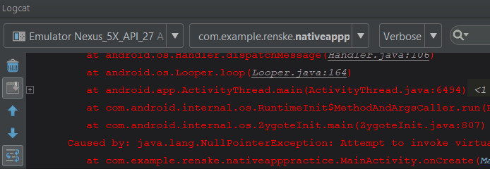

## Plain Java vs. Android Studio
Naturally, you will encounter different kinds of exceptions in Android Studio as well. These exceptions will be printed to the console. To accurately solve them it is important to understand why they happen and where they come from. Sometimes the content of these exceptions gets very long, which makes them rather cryptic. In this section we will look at a few common exceptions and explain what to look for and how to discover where they came from. 

### Unraveling exceptions
When exceptions occur during the testing of your app, they are printed to the logcat console. Most of the times the exception starts with a timestamp and the keywords `FATAL EXCEPTION: main` indicating that it occured on the main thread and caused the app to crash. This is followed by a lot of information like below, which can be hard to read. 

        08-07 09:10:30.091 14777-14777/com.example.renske.nativeapppractice E/AndroidRuntime: FATAL EXCEPTION: main
            Process: com.example.renske.nativeapppractice, PID: 14777
            java.lang.RuntimeException: Unable to start activity ComponentInfo{com.example.renske.nativeapppractice/com.example.renske.nativeapppractice.MainActivity}: java.lang.NullPointerException: Attempt to invoke virtual method 'void android.widget.ListView.setAdapter(android.widget.ListAdapter)' on a null object reference
                at android.app.ActivityThread.performLaunchActivity(ActivityThread.java:2778)
                at android.app.ActivityThread.handleLaunchActivity(ActivityThread.java:2856)
                at android.app.ActivityThread.-wrap11(Unknown Source:0)
                at android.app.ActivityThread$H.handleMessage(ActivityThread.java:1589)
                at android.os.Handler.dispatchMessage(Handler.java:106)
                at android.os.Looper.loop(Looper.java:164)
                at android.app.ActivityThread.main(ActivityThread.java:6494)
                at java.lang.reflect.Method.invoke(Native Method)
                at com.android.internal.os.RuntimeInit$MethodAndArgsCaller.run(RuntimeInit.java:438)
                at com.android.internal.os.ZygoteInit.main(ZygoteInit.java:807)
            Caused by: java.lang.NullPointerException: Attempt to invoke virtual method 'void android.widget.ListView.setAdapter(android.widget.ListAdapter)' on a null object reference
                at com.example.renske.nativeapppractice.MainActivity.onCreate(MainActivity.java:34)
                at android.app.Activity.performCreate(Activity.java:7009)
                at android.app.Activity.performCreate(Activity.java:7000)
                at android.app.Instrumentation.callActivityOnCreate(Instrumentation.java:1214)
                at android.app.ActivityThread.performLaunchActivity(ActivityThread.java:2731)
                at android.app.ActivityThread.handleLaunchActivity(ActivityThread.java:2856) 
                at android.app.ActivityThread.-wrap11(Unknown Source:0) 
                at android.app.ActivityThread$H.handleMessage(ActivityThread.java:1589) 
                at android.os.Handler.dispatchMessage(Handler.java:106) 
                at android.os.Looper.loop(Looper.java:164) 
                at android.app.ActivityThread.main(ActivityThread.java:6494) 
                at java.lang.reflect.Method.invoke(Native Method) 
                at com.android.internal.os.RuntimeInit$MethodAndArgsCaller.run(RuntimeInit.java:438) 
                at com.android.internal.os.ZygoteInit.main(ZygoteInit.java:807) 

When confronted with this, there are a few things to look out for. 

1) The kind of exception that occured.

2) The offending file.

3) The line inside that file that caused the exception. 

The kind of exception can be spotted two times in this case, it is the least indented line preceded by "Caused by:". In this case we are dealing with the infamous `java.lang.NullPointerException`. This line also tells us the other things we need to know:

        Caused by: java.lang.NullPointerException: Attempt to invoke virtual method 'void android.widget.ListView.setAdapter(android.widget.ListAdapter)' on a null object reference

We attempted to invoke (call) a method, `setAdapter()`  on a null object reference. This does *not* mean that `setAdapter()` itself was null. It means that the object on which we attempted to call `setAdapter()` was null. When debugging this is an important distinction to make, as squashing bugs becomes hard when you are not taking care of the actual culprit!

Now that we understand what went wrong, we of course want to know where it went wrong. Luckily for us Android studio also mentions the location of the error. Since apps are complex the error resonates in a lot of other locations, hence the list of "at ...". However the line we are looking for is this one:

        at com.example.renske.nativeapppractice.MainActivity.onCreate(MainActivity.java:34)

Here we can clearly see that the error occurs in `MainActivity`'s `onCreate` at line 34. In Android Studio, this part will be highlighted (usually in blue, depending on your color theme) and when clicked will take you to exactly this line. Neat!

When we take a look at the code, we see the following:

        listView.setAdapter(new PlantAdapter(this, R.layout.row_item, plants));

With the information we know, `setAdapter()` being called on something that is apparently `null`, we can now solve it. We need to check and verify that the variable `listView` is correctly initialized, because according to the error this variable is `null`. This could be due to different reasons, but the important part is that we are aware what exact part of our program is causing the error.

### Logcat tips

 The logcat often puts out a lot of things, which can make it hard to find what you need to know. To make reading the exceptions and solving them a bit easier, there are a few things you can do.

- You can filter the logcat output by using the dropdowns on top. By setting it to "Error", it will only show messages that fit this description, like exceptions. Additionally, you can use the search function as well. (Don't forget to unset the filter/search if you are looking for other things that do not fit this category later!)

    

- These dropdowns also distinguish between different devices (for example the emulator and your phone) and processes. Sometimes a process is indicated as dead and does not update the log anymore. Usually when you rerun the app, the log automatically restarts, but sometimes it stays on the dead process. This means that if you rerun the app, you need to switch to the other, active process if it is not doing so automatically.

- To free up some space (especially on smaller monitors), you can go to the logcat settings. These are behind the cogwheel icon  , which is sometimes hidden behind a small arrow icon if your logcat's height is too small. In these settings, you can uncheck "show process and thread ID" and "show package" as these are not important to us in this course. This frees up some space.

- To increase readability and avoid scrolling, you can turn on wraparound, which has its own icon on the left bar. 

### When to use try catch
When creating your app, Java sometimes forces you to use a try-catch structure. This is mostly when you are working with I/O such as loading files or reading things from the raw/assets folder. Parsing JSON will also require you to use try-catch.

It is of course not a solution to surround every potential null pointer with try catch for basic things like initializing views. In general you should still be aware of errors. However if you have an operation that might fail at runtime and crash the app, for example due to loss of connection, files that aren't where they are supposed to be etc. then it is a good idea to use the try-catch structure to prevent a runtime crash. 