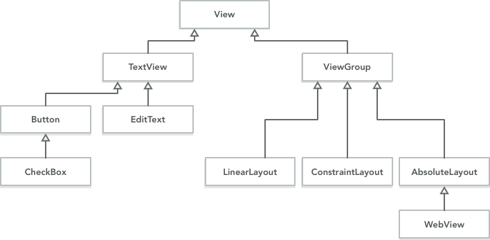
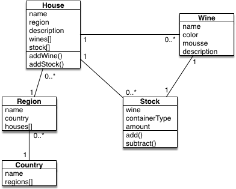

# Model classes

All things considered, Android applications are pretty big in terms of source code. Because a single app combines functions such as responding to user interactions, data access, and many other things, it can be daunting to find where some particular function has been implemented. To solve this problem, many application frameworks (one of which is the Android platform) make sure that applications' code is organized using some kind of **organizational pattern**. In the case of GUI programs and Android in particular, you can look at your code through the lens of the **model-view-controller** pattern (MVC). This pattern specifies three areas that each part of your code belongs to:

-   **Controllers.** These are classes that receive and process messages from the user interface, for example when a user taps on a button. You might have guessed that `Activity` classes in Android are actually controllers. Not only user interactions may initiate actions in the controller, but also things like an online database, where some other user makes changes that are immediately visible in other people's app. Such changes are also initially received by the controller. The idea is that code in the controller is high-level, not too long and delegates work to other classes.

-   **Views.** These are classes that are reponsible for displaying data on screen. Many of these classes have already been written for you: `ListView` would be one of them, as well as `Button`. But, as you learned earlier in the course, `LinearLayout` is also a type of view: it manages the layout of other views.

    Take the following tree of view classes. At the top of the hierarchy is `View`, which defines anything that represents some screen element. Then, there is `TextView`, which defines almost anything on screen that has text in it: not only the `ExitText` where users can enter text, but also `Button`, which (all things considered) is just a couple of words with a fancy border. Next to that, we have `ViewGroup`, which is a kind of view that can *contain* other views. Of note are the layouts that you use when creating a screen for an Android project. Finally, a bit of an outlier is the `WebView`, which is not intended to contain other views, but nevertheless behaves a little bit like a layout.

    

    Now, important to remember about view classes is that your almost never write them yourself! These classes are part of the platform, and you should be able to make just about any app without creating new view classes. It is possible, though, for example when you would like to create buttons that look very different from the standard buttons.

-   **Models.** These are classes that concern the data that's interesting to the user. For example in a wine collector's app, there may be many classes that represent wines, locations, wine houses, and more.

    

    Model classes might also contain important algorithms that belong to your app, for example if you make an app that can add visual effects to photos. You haven't come across many model classes as of yet, but that's about to change!

Technically, this description of things deviates a little from the original idea of the MVC pattern. However, the point is that you can think of your code as being divided among three types of classes. This helps you more easily form a mental model of your own code.

## Business objects

There is a special kind of model class, which is the **business object**. These are classes that represent something in the real world that you would like to have in your app. This is exactly what we were thinking of when giving the "wine collector's app" example, above. The business object is a class that comes very close to being a **structure**, containing data but no logic (algorithms). Here's an example:

    public class Wine
    {
        public String name;
        public int vintage;
    }

Now, in reality, you may want to add some logic to these classes, a constructor for example, and getters and setters, which can together make sure that the objects of this particular class are actually valid. In the following example, the instance variables are *private* and it is impossible to create an instance of the `Wine` class without providing a `name` and a `vintage`.

    public class Wine
    {
        private String name;
        private int vintage;
        
        Wine(String name, int vintage)
        {
            this.name = name;
            this.vintage = vintage;
        }
        
        public int getVintage()
        {
            return self.vintage;
        }
        
        public String getName()
        {
            return self.name;
        }
    }

<!--

## Demonstration video

## References

- [Shortcuts](http://stackoverflow.com/questions/14206434/android-do-we-have-to-manually-create-model-classes) for creating model classes in Android Studio

- To refresh your memory, [here](http://www.journaldev.com/9383/android-internal-storage-example-tutorial) is a short tutorial on how to save data to the internal memory of your phone (as you will implement in this week's app).

- If you still feel a bit overwhelmed by OOP (*Object Oriented Programming*), read [this](http://www.vogella.com/tutorials/JavaIntroduction/article.html) guide on Java Programming. For this week's assignment you can skip to part 4: *Java language structure*, which explains how classes work. However, parts 6 and 7 also contain a lot of useful information.

-->
