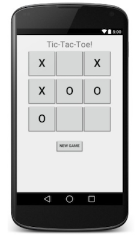
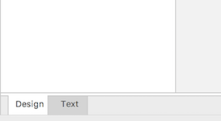
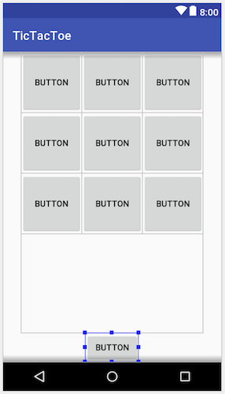

# Tic Tac Toe

## Objectives

- Practice with model classes.
- Create nice layouts.

## Background

Tic-tac-toe is a very simple game: you don't need much in terms of attributes, and the rules are simple. A perfect game to model into its own class!

Write a basic game of tic-tac-toe, where two players take turns pressing buttons in a 3x3 grid to mark "X" or "O" characters on them respectively. If any player can place three of their letter in a row horizontally, vertically, or diagonally, that player wins the game.
Setting up the buttons for the game is a good opportunity to practice using GridLayout. You'll probably want to set the buttons to have a large size so that they fill a large portion of the screen, as well as giving them a large font to make them easier to read and click.
If you want a simpler implementation, you can write your code as though two human players were playing it on the same screen; the first tap is an X move, the second is an O move, and so on. If you want more challenge, you could have the computer play as the second player. A simple strategy would be to just randomly move on any open square, but a more complex computer player would try to "block" the human player if the human has any two-in-a-rows and is one move away from winning the game.

## Getting started

1.  Create a new Android studio project called **TicTacToe**, using these settings:
    - Choose API 24 (Nougat) unless your own phone has an older operating system
    - Start with an Empty Activity which is called `MainActivity`
    - Leave all other settings unchanged

2.  Create a new, empty repository on the Github website. Name your repository `Tic Tac Toe`.

3.  Now, add a git repository to the project on your computer. Go to Android Studio, and in the menu choose **VCS -> Enable Version Control Integration**. Choose **git** as the type and confirm. This will not change much, but sets us up for the next steps.

    Note: if you get a popup to ask whether you would like to add some file to the repository, answer "No" for now. If you answer "Yes", things may get complicated later on.

4.  Link the local repository to your Github project. Choose **VCS -> Git -> Remotes...**. Add a remote with name "origin".

5.  Android Studio has generated quite a few files for your project already. To add these, let's **commit** and **push** those files to Github. Press **Cmd-K** or **Ctrl-K** to show the Commit Changes screen. There, you should see a long list of "unversioned files". Make sure all checkboxes are selected, enter a commit message `Initial project` and then press the **commit** button. Turn off code analysis.

6.  Press **Cmd-Shift-K** or **Ctrl-Shift-K** to show the Push Commits dialog. Press the **Push** button to send everything to Github.

Your project files should now be visible on Github. If not, ask for help!

## Creating the user interface

Let's create the basic UI first: head to `activity_main.xml` in your project. As usual, we get a blank screen with a `ConstraintLayout`. This type of layout is not particularly ideal for our purposes. What we'll do is replace it with a `LinearLayout` and then use a `GridLayout` for the button grid.

<iframe src="https://player.vimeo.com/video/211268580" width="320" height="200" frameborder="0" webkitallowfullscreen mozallowfullscreen allowfullscreen></iframe>

1.  You can only replace the **root layout** for a screen by editing the underlying XML file. Use the tabs at the bottom of the layout editor to switch to **text mode**:

    

2.  On the second line, delete the `android.support.constraint.ConstraintLayout` and replace it by `LinearLayout`. The closing tag on the last line should be updated automatically.

3.  Switch back to **design mode**. Select the LinearLayout in the component tree and set its `orientation` attribute to vertical. This way, it will distribute all embedded views over the height of the screen.

4.  Delete the `TextView` that may still be inside the layout. Now go to the palette, select **layouts** and drag a `GridLayout` from there onto the `LinearLayout`, either in the component tree or in the designer.

5.  Add 9 buttons to the GridLayout. Also, add 1 button directly to the LinearLayout, below the grid. Don't worry if that last button is currently invisible.

6.  Let's make all buttons the same size. Select all buttons in the component tree and set these properties:

    - Set `layout_width` to `100dp`
    - Set `layout_height` to `100dp`

7.  Currently, the buttons are aligned to the left together with the GridLayout. Set the GridLayout's `layout_width` to `wrap_content`. This makes sure the layout is about 300dp wide. We can then center it in the containing layout by setting `layout_gravity` to `center`.

8.  Now, we'd like to have the reset button take up as little space as possible, while still being fully visible:

    

    To do that, select the `GridLayout` and set its `layout_weight` to 1. It works like this: because the reset button has no `layout_weight`, its size is determined by its `layout_width` and `layout_height` properties. In this case, they're set to `wrap_content`, which makes the button as small as possible. Besides, we gave the grid a weight of 1, which means that the *rest* of the height will be assigned to it. (We could add another element of weight 1 to the linear layout, and the height would have been evenly split between the grid and that other element.)

9.  Finally, add an `onClick` handler to each of the grid buttons. Select them all in the component tree to do that. Name the handler `tileClicked`. Also, set the reset button's `onClick` to a handler called `resetClicked`.

This finalizes the user interface.

## Communication between activity and game

We'll create a Game class later on, but first, we'll define two enums to specify the **game state**.

1.  Go to **File > New > New Java Class...**. Enter the name `GameState` and kind `Enum`. Leave other settings unchanged and press OK.

2.  In the `GameState` enum, add the following constants:

        IN_PROGRESS,
        PLAYER_ONE,
        PLAYER_TWO,
        DRAW,

3.  Go to **File > New > New Java Class...**. Enter the name `Tile` and kind `Enum`. Leave other settings unchanged and press OK.

4.  In the `Tile` enum, add the following constants:

        BLANK,
        CROSS,
        CIRCLE,
        INVALID

## The game (model class)

1.  Go to **File > New > New Java Class...**. Enter the name `Game` and kind `Class`. Leave other settings unchanged and press OK.

2.  We need a board! Atop the class, declare a constant and a variable to hold the board:

        final private int BOARD_SIZE = 3;
        private Tile[][] board;

    See that our board is an array of `Tile`s? Each tile can be one of the states that is specified in `Tile.java`. Also, we'll need to have some variables that keep count:

        private Boolean playerOneTurn;  // true if player 1's turn, false if player 2's turn
        private int movesPlayed;
        private Boolean gameOver;

3.  Let's make a constructor. When creating a new game, the above fields have to be initialized to sensible values. Press **Cmd-N** or **Alt-Insert**, which pops up some choices for generating code. Choose `constructor`. Then choose "Select None", which means that our new constructor does not have any parameters. Add the following initializers:

        board = new Tile[BOARD_SIZE][BOARD_SIZE];
        for(int i=0; i<BOARD_SIZE; i++)
            for(int j=0; j<BOARD_SIZE; j++)
                board[i][j] = Tile.BLANK;

        playerOneTurn = true;
        gameOver = false;

4.  Finally (for now), the Game class should definitely have a method that allows a user to "play". In this case, the current user can choose any unused place to place their square or circle. Define a method `draw` to handle that:

        public Tile draw(int row, int column) {

    Now, what should this method do? Let us help you scaffold that:
    
    - It has to retrieve the current value of the board at position (row, column).
    - If that place is still blank, we can go ahead and fill it.
        - if the current player is player one, fill it with a cross
        - if the current player is player two, fill it with a croos
        - in either case, make sure the other played gets the turn
        - also in both cases, make sure to return Tile.CROSS or Tile.CIRCLE to allow the UI to update
    - If that place isn't blank, it's an invalid move! Just return Tile.INVALID.

## The controller

Next up, head to `MainActivity.java`.

1.  Atop the class, add a variable for holding the game:

        Game game;

2.  We'll initialize the game in `onCreate()`. Add the following line to the bottom of that method:

        game = new Game();

3.  First, set up a method that will process tile clicks:

        public void tileClicked(View view) {

    What should this method do? Let us help you out there:
    
    - It has to translate the button into the right coordinates. Use `int id = view.getId();` to find out which button it is, and (temporarily) store the corresponding `row` and `column`.

    - It has to feed those coordinates to the `Game`s `draw` method:
    
            Tile tile = game.draw(row, column);

    - Depending on the outcome of the `draw` method, it has to update the selected button. Here's a starter:

            switch(tile) {
                case CROSS:
                    // do something
                    break;
                case CIRCLE:
                    // do something
                    break;
                case INVALID:
                    // do something different
                    break;
            }

4.  Create the method `resetClicked()` for the reset button. Here, we can simply throw away the old game and create a new one:

        game = new Game();

    But don't forget to reset the UI as well!

## More features

Make sure your game works as expected before continuing. Then, it's time to add state preservation to the app, in case it is backgrounded or rotated. Refer to [last week's doc](/android-reference/state) for more info.

Specifically, make sure that your `Game` class is augmented with `implements Serializable`. You can then simply save the current game instance in your `onSaveInstanceState()` method. As before, you can reload the saved game in `onCreate()`.

Tip: press **Ctrl-O** to popup the **Override Methods** dialog, type a few characters `onsave...` and press ENTER to create your `onSaveInstanceState()` method.

To fully restore the game, you will have to add methods to the `Game` class to ensure that you can find our the state of each tile.

## Finishing up

As always, consider this week's assessment criteria and make sure your app works well and the code looks nice.

## Some ideas

Here are some ideas for improving on this project:

- Use nice large pictures of crosses/circles instead of text in the buttons. Add the pictures as resources (like in Mr. Potatohead).

- Let your user play against the computer. This requires changes to the Game class, but also to your activity.

- (Very advanced) Allow the user to choose either a two-player game or play against the computer. Keep the separation between the game class(es) and the activity.

- Remove the reset button and provide a reset option in the activity bar menu instead, using [this tutorial](https://www.journaldev.com/9357/android-actionbar-example-tutorial).

