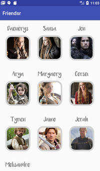
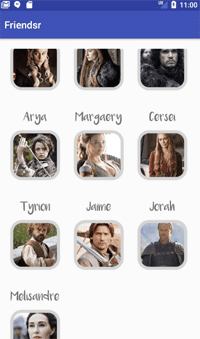
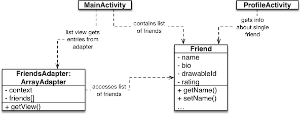
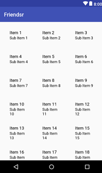

# Friendsr

## Objectives

- Practice with lists of data
- Practice with adapter views
- Work with navigation in apps
- Use multiple activities
- Store small amounts of data on the device

## Background

For this app, you will create an social friends app that allows you to view people's profiles and some information about them. When the user first loads the app, it will show a list of available users. The user can click on each one to see a bigger photo and get more information about that user. On the screen is a way to rate the user. It could for example look something like this:

  

Of course this app will be an incomplete experience: you don't need to allow people to create profiles, and you can just show a fixed set of people's profiles that never changes. It does not need to do everything that an app like Facebook can do. Supply your own images, or [download a set of characters](images_friendsr.zip) from a TV series that shall remain unnamed.

To create this app, we will make use of two *Activities* e.g. screens in our app, one that shows a list with an overview of all people available in the app, and another that is triggered when we click on one of these people which provides more details and a bigger profile picture.

The ratings we give to each of the app's profile's will be stored using `SharedPreferences` which allows the rating to persist, even when we leave the `Activity` or shut down our app (or phone!) altogether. 

## Getting started

1.  Create a new Android studio project, using these settings:
    - Choose API 24 (Nougat) unless your own phone has an older operating system
    - Start with an Empty Activity which is called `MainActivity`
    - Leave all other settings unchanged

2.  Go to <https://github.com/new> and create a new, empty repository. Do not allow it to add a `README`. You may leave all other settings unchanged.

3.  Add a git repository to the project on your computer. Go to Android Studio, and in the menu choose **VCS -> Enable Version Control Integration**. Choose **git** as the type and confirm. This will not change much, but sets us up for the next steps.

    Note: if you get a popup to ask whether you would like to add some file to the repository, answer "No" for now. If you answer "Yes", things may get complicated later on.

4.  Link the local repository to your Github project. Choose **VCS -> Git -> Remotes...**. Add a remote with name "origin". You can find the URL on the Github project you just created.

5.  Android Studio has generated quite a few files for your project already. To add these, let's **commit** and **push** those files to Github. Press **Cmd-K** or **Ctrl-K** to show the Commit Changes screen. There, you should see a long list of "unversioned files", which should be selected. Enter a commit message `Initial project`, turn off code analysis, and then press the **commit** button.

    **Note:** some files may be selected while there are still a lot of "unversioned files". Make
    sure to select *all* of the files before continuing.

6.  Press **Cmd-Shift-K** or **Ctrl-Shift-K** to show the Push Commits dialog. Press the **Push** button to send everything to Github.

Your project files should now be visible on Github. If not, ask for help!

## App architecture

We'll create the app like this:

- there are now *two* activities, one for showing the list, one for showing the details
- there are `Friend` objects, one for each friend
- the list of `Friend`s is contained in a special class, the `FriendsAdapter`
- the `FriendsAdapter` is a subclass of `ArrayAdapter` and can be directly linked to the grid view in the main screen

Study the diagram and the descriptions well before starting to create your app!

## First activity: creating the user interface

Let's create the basic UI that we should see when we open the app first: head to `activity_main.xml` in your project. As usual, we get a blank screen with a `ConstraintLayout`. This type of layout is not particularly ideal for our purposes. What we'll do is replace it with a `LinearLayout` and then use a `GridView` to show all of our users on a grid. 

- In the XML, change the `ConstraintLayout` to a `LinearLayout` (remember how?). Also, delete the text view that's already in there.
- In the designer, head for the Palette and choose **Legacy**. There you should be able to select a `GridView` and add it to your layout. If done correctly, your design should now show an example grid of items, something like the image above.
- You can tweak the attributes of the `GridView` to show more or less items on a row or have more space between items. Take a look at `numColumns` and `stretchMode` and see if you can tweak it to look how you want. Feel free to deviate from the example. If 4 columns is the way to go: power to you!

## Modeling friends

Now that the main screen is all set, let's create a model class to contain data about each of our friends. This model class will contain the info about the friends that show up in the app. We do this so we can keep track of all of the information together, such as their name, picture, rating and information/bio. 

1. The `Friend` model will be held in its own Java class. First, select `MainActivity` in the browser on the left and then choose **File > New > Java Class**.

2. We will call the class `Friend`. In the dialog, also specify that you want to use the `Serializable` (or `java.io.Serializable`) interface. This will allow us to store `Friend` objects on the device more easily. You can leave all other settings unchanged.

    (If Android Studio offers to add the new file to the git repository, feel free to do so.)

3. You are now presented with your empty `Friend` class, so time to add some fields to it! Within your class, declare fields to store the name and bio of a user. These should probably of the type `String`. Also, we will need a `float` to keep track of the rating, because the `RatingBar` widget uses a float by default. Finally, we want to keep track of an id that points to a drawable, to be able to show an image. This id will be of type `int`. You should now have something like this:

~~~ java
        public class Friend implements Serializable {
            private String name, bio;
            private int drawableId;
            private float rating;
        }
~~~

Note that the names of the fields are grey currently: this means that the fields aren't used anywhere useful, yet. But this will come soon!

5. Our class also needs a constructor, which we can now easily generate using **Alt+Insert** or **Cmd+N**. As our constructor fields, we want to set the `name`, `bio` and `drawableId`, but not the rating.

6. Although our fields are currently `private`, we should be able to read the values using a getter. Using the same shortcut as the previous step, add getters for all fields.

7. Finally, go to that menu once more, and add a setter for the `rating` field. We are going to allow the user to change the rating within the app, so we should be able to change the rating through this setter!

## Creating some sample friends

We'll need to create some friends to show in our app later. We are going to instantiate some `Friend` objects in `MainActivity`. But first, let's add some cute images with photos of our friends.

1. Just for a second, switch to the Project View using this dropdown:

    

2. Navigate to the `app` > `src` > `main` > `res` > `drawable` folder. Drag the downloaded image files into that folder. Android Studio will offer to move/copy them, and then to add them to your local git repository. That's all fine.

3. Jump back to the Android View using the same dropdown as in step 1. You can now use the images in your app.

Let's make an `ArrayList` of sample friends in `MainActivity`. Since we are storing `Friend` objects, declare the list as follows:

~~~ java
    ArrayList<Friend> friends = new ArrayList<>();
~~~

Your task is to write code in the `onCreate()` for adding all friends. You can add items to the list using the `add()` method. This method requires you to provide a `Friend` object.

For the adding of the drawable's ID, you can use `getResources().getIdentifier()` which can provide you with the correct reference to your drawable.

## Adding a layout for the grid view

Because a `GridView` is just the container for our items, the layout for the items themselves will be defined elsewhere. Let's create a new layout file.

- Go to the `layout` folder, right click on it, and use **New > Layout resource file** to create a file called `grid_item.xml`.

- For the root element, specify `LinearLayout`. No need to change other options.

- We have some wishes as to what the items on our grid should look like. Ideally, we would want to show at least a picture and the name of our friend. Add those to the layout.

Tip: add some padding to your layout! Click "Show more attributes" if needed. Add padding to the root `LinearLayout`, something like 12dp (12 device pixels). You can also add padding to views within the layout, to make sure the views don't stick together too much.

> Now might be a good time to try building and running your app. If any errors pop up, try to solve those first and ask for help. Otherwise, the app is pretty boring! Even though we have a grid view in the main layout, it doesn't show anything.

## Creating an adapter class

To fix this, we need a way to pair the list of `Friend` objects with the grid layout. The missing connection will be made through an **adapter**. The adapter will be responsible for providing grid items for the grid view. It does this by loading a layout and filling the views in that layout with data from our list of friends. Let's create it.

Make sure you have selected one of your Java classes in the Android browser, then go to **File > New > Java Class** and create a class called `FriendsAdapter`. We will use `ArrayAdapter` as the superclass, which provide much of the functionality of using data from an `ArrayList` to fill our grid items.

> Did you notice that Android classes always have a name that **ends** with the kind of class it is? `MainActivity` and `FriendsAdapter` are examples. However, the `Friend` class is special: it is not of any special Android kind, so it is simply called `Friend`.

- Change the declaration of the class to subclass `ArrayAdapter<Friend>` like the following snippet of code, this tells Java that our list is supposed to be a list of `Friend` objects, specifically.

~~~ java
        public class FriendsAdapter extends ArrayAdapter<Friend>
~~~
    
- Generate a constructor using `CTRL+O`: choose the constructor that takes context, a resource id of type integer and a list of items `List<T>` as its arguments.

- When you have generated your constructor, change the parameters to reflect the type of your list, which is an `ArrayList<Friend>` instead of `List<Friend>`.

- Finally, hit `CTRL+O` one more time to override `getView()` (find it in the list), which is the method where we will determine what should be shown on the screen for each item in our list. 

> If you get compiler issues because of the `@NonNull` or `@Nullable` annotation, you can remove the `@androidx.annotation.@NonNull` part to fix the compiler errors. It is not necessary for the code, merely a flag like `@Override`. 

Take a look at the `getView()` method that was just generated. This method will be called every time a new grid item is to be displayed (for example, when scrolling). The method gets three arguments. The first argument `position` indicates which item in the list we'd like to show. As usual, this position is zero-based.

We'd like to load a specific layout and show the data we're interested in. This is where that happens. For reasons of efficiency, the layouts in a list are recycled. As we scroll up, views from the top (that disappear) are moved to the bottom to show new data. As the grid is shown for the first time, however, we'll need to load the layout for each new grid item.

Replace the `return super.getView...` by the following code:

~~~ java
    if (convertView == null) {
        convertView = LayoutInflater.from(getContext()).inflate(R.layout.grid_item, parent, false);
    }
    
    return convertView;
~~~

Notice that convertView is **inflated** from `R.layout.grid_item`, which is the layout in the file `grid_item.xml` that we just created. This layout contains a couple of views, that we would like to fill with the appropriate info from our list of friends.

- When the adapter is instantiated, we get access to the list of friends (via the constructor). Better then, to create a `private` instance variable called `friends`, and in the constructor, save the reference to the list to that variable!

- In `getView()`, you can get access to the layout's views by way of the method `convertView.findViewById()`, just like you would do in an activity. Make sure that you gave the views an ID in the layout designer!

- Getting data from the `ArrayList friends` can be done using the `friends.get()` method, providing the index of the `Friend` that we'd like to display.

- To load a `Drawable` image for putting into the `ImageView`, use the following line of code `anImageViewReference.setImageResource(aDrawableId);` while remembering that we saved resource ids for each of our friends in the friends list already!

> Note that instead of returning the standard result of calling `super()`, we now return our altered `convertView`. What do you think would happen if we forgot to return `convertView` at the end and still returned the result of the `super()` call? And what would happen if we called `super()` first and then altered `convertView` after that?

## Connecting the adapter to the grid view and the list

Now that the adapter class has been (hopefully) set up correctly, we still have to instantiate it and link it to the `GridView` in our layout.

- First, instantiate your adapter in `MainActivity`, because this is where we want to show our list of friends on the grid. The constructor expects three arguments:
    
        FriendsAdapter adapter = new FriendsAdapter(..., ..., ...);

    1. The `FriendsAdapter` class constructor takes in a `Context` object. Usefully, the activity itself provides context, so you can suffice with `this` as the first argument.

    2. Then, it needs a reference to the layout file it should use, which is `R.layout.grid_item` if you indeed named the layout `grid_item.xml`.

    3. Finally, the list of `Friend` objects itself needs to be passed to the constructor as well.

- Now that you have instantiated your adapter, you can attach it to your `GridView`. Use `findViewById` on your `GridView` as you would on any other view and call the method `setAdapter()` on it with your freshly made adapter!

This was the final step for showing our initial screen with a grid of friends. Test your app now, and ask for help if something doesn't work as expected.

## Creating a new activity

As you can see in the screenshots above, we'll make a detail screen where friends are shown full-screen.

- To create a second activity, select one of your existing Java classes in the browser and choose **File > New > Activity > Empty Activity**. Name it `ProfileActivity`.

- If everything went well, you should now also have a `activity_profile.xml` file in your layout directory. This is where we will design the layout of our second activity.

- We'd like to show the profile picture, a rating bar, as well as some `TextView` elements to show the name and information of our users. But before adding those, change the root layout to `LinearLayout` again (this just fits with what we want to achieve much better).

Make sure the layout looks nice by fiddling with the `layout_gravity` parameter to for example make things center aligned. To determine how much space each view should take up on the screen, you can use the `layout_weight` attribute. This attribute allows you to give some views more importance in the sense that they should take up more space on the screen. This could be useful if we want to make the profile picture show up nice and big in comparison with the rest of the content. This works for most views, however for the ratingbart the `layout_weight` property does not behave consistently (it might cut off the stars horizontally), so it's best to omit it. 

Additionally, because we are using the weight to determine the size relative to the rest of the layout, it works better on other phone sizes, as opposed to hard-coding values to determine the size of views. 

## Connecting the two activities

Our goal is now to have a user click on one of the friends in the grid, and navigate to the second activity. This second activity should, of course, provide details on the friend that was selected, and no one else!

To add a listener for clicks on our `GridView`, we will create our own `OnItemClickListener` class (not to be confused with the `OnClickListener`, since we are really listening to clicks on the separate sub-items here, not clicks on the layout view as a whole). 

1. Go to your `MainActivity` (not the `ProfileActivity`!) code and write a new private inner class called `GridItemClickListener`. **Inner class** means that the class will actually be inside your `MainActivity` class, not in a separate file:

~~~ java

        public class MainActivity extends AppCompatActivity {
            .
            .
            .
            private class ThisIsAnInnerClass implements ... {
                ...
            }
            .
            .
            .
        }
~~~

2. Add the interface to the class by typing `implements OnItemClickListener` behind the name of your class. It will probably jump to show `AdapterView.OnItemClickListener` as you finish typing: this is okay. This will make red wriggly lines appear, because now your class made a promise, so to speak, to implement the functionality of an `OnItemClickListener`, but it does not do that just yet!

3. With your text cursor place inside the inner class, press **Ctrl+I** to show the **Implement Method** dialog. There is only one choice: `onItemClick()`. Hit enter and the red wriggly lines should now disappear as the method is placed in the class.

4. Finally, connect this listener to the `GridView`. Somewhere in the `onCreate()` method of `MainActivity`, perform these steps:
    - Get a reference to the grid view using `GridView gv = findViewById(R.id.grid);`
    - Call the `setOnItemClickListener()` method on the view, providing a `new GridItemClickListener()` as the argument.

At this point, test your code by putting a log message inside the `onItemClick()` method of your listener class. The log should be shown every time an item in your `GridView` is clicked (it is shown in the **Run** tab, which you may need to open using ).

## Extract what actually was clicked on

The whole idea of the OnItemClickListener was to recognize exactly which sub-item of our layout was clicked, but as of now that is not happening yet. However, all tools to do this are present. When taking a look at the `onItemClick()` method, notice that this method has 4 arguments that will be passed on to it when it's invoked.

We will make use of the `parent` argument, which holds a reference to the parent view with all the items, combined with the `int position`, which tells us the position. You can call the method `getItemAtPosition(i)` on the `parent`, which then will give you what item is present on that position in the parent layout behind the scenes. 

This is what we want, because we made a list of `Friend` objects that are now being rendered by our adapter. So if we call `getItemAtPosition()`, we will get back a `Friend` object that we can the use to pass on to the second activity. 

~~~ java
    Friend clickedFriend = (Friend) parent.getItemAtPosition(position);
~~~

Try changing your log message to print the `name` of the `Friend` object!

> Notice that `(Friend)`? This is called *casting* and is necessary because `getItemAtPosition()` does not actually return a `Friend` object yet, but a generic Java Object. So if we want to put it in a variable of type `Friend` it will need to be cast to that type first. When working with custom model classes, this is something that is often needed, but luckily very simple to do. 

Now that we have access to which `Friend` item was actually clicked, we want to pass this information to the next activity. To direct the user from one activity to another, Android makes use of the `Intent` class. An `Intent` typically looks something like this:

~~~ java
    Intent intent = new Intent(MainActivity.this, ProfileActivity.class);
    startActivity(intent);
~~~

It specifies the context where we are coming from, in this case `MainActivity.this` and also tells the intent where to go next, which is the `ProfileActivity.class`. A special thing to pay attention to with an `Intent` is that you still need to *perform* it. Creating an `Intent` object in itself does nothing yet in terms of starting another activity. 

Remember that we made the `Friend` model class implement `Serializable`? This was done so that you can now easily pass `Friend` objects with intents. Adding something to an `Intent` is done with key-value pairs, with the key (which is just a `String`) allowing you to retrieve the value from the intent in the next activity. In our case, the intent might look something like this:

~~~ java
        Intent intent = new Intent(MainActivity.this, ProfileActivity.class);
        intent.putExtra("clicked_friend", clickedFriend);
        startActivity(intent);
~~~

We just added the clicked `Friend` object to the intent, so it will be passed on `ProfileActivity` and we can extract it using the key `"clicked_friend"`.

Now, in the `onCreate()` of the second activity, you can simply use `getIntent()` and then extract the value from the intent using the key you provided when you created the intent:

~~~ java
        Intent intent = getIntent();
        Friend retrievedFriend = (Friend) intent.getSerializableExtra("clicked_friend");
~~~

Of course, you will want to put the result of `getSerializableExtra()` in a variable so that you can do something with it (notice that we are casting it again?). Now that we have access to the `retrievedFriend` variable, we have access to all the information of that particular `Friend` object again, so their name, bio, photo and rating. You can use this information to render the correct things on the screen with the layout we created before. 

## Storing the rating data in SharedPreferences

Hmm, now that your app is up and running, you must have noticed something. The ratings are not being kept! Time to do something about that using Android's `SharedPreferences`. These are meant to store small amounts of data on the device and allow information to persist even when closing down the app or switching off your phone.

`SharedPreferences` again makes use of key-value pairs, using a `String` as the key and then storing the value with the key as a label, so you can easily retrieve it later. You can access your app's `SharedPreferences` by calling:

~~~ java
        SharedPreferences prefs = getSharedPreferences("settings", MODE_PRIVATE);
~~~

You can have multiple `SharedPreferences` files, so you can give individual ones a name as well, we will just call ours `settings`. The `MODE_PRIVATE` bit refers to the access rights of the file: the default mode, where the created file can only be accessed by the calling application and not other applications.

We can now add things to the `SharedPreferences` by calling methods on our variable `prefs`, to generate an `Editor`:

~~~ java
        SharedPreferences prefs = getSharedPreferences("settings", MODE_PRIVATE);
        SharedPreferences.Editor editor = prefs.edit();
~~~

The `Editor` allows you to edit the file and store values in there. The two lines above can also be simplified to one line where we directly grab the editor:

~~~ java
        SharedPreferences.Editor editor = getSharedPreferences("settings", MODE_PRIVATE).edit();
~~~

The `editor` variable now allows you to call various methods, like `putInt()`, `putString()` and `putFloat()`, all of which take two arguments, the key under which to store the value (think about what that should probably be in our case), and the value itself. When done adding values to the editor, don't forget to call `editor.apply()` to save the changes. 

Now you need to determine when to store the rating. Chances are the `OnRatingBarChangeListener` will be quite useful, because it will fire the `onRatingChanged()` everytime someone touches the ratingbar. You can implement your own `OnRatingBarChangeListener` inner class the same way you did with the `OnItemClickListener`. The creation of inner classes for listeners is a design pattern that will be repeated many more times with listeners of various kinds, so if in doubt be sure to ask.

 
## Retrieving values from SharedPreferences

Just storing the data is something, but if we don't do anything with it to restore our rating's state, we might as well do nothing. Your `ProfileActivity` still needs to somehow check whether any rating should be restored, and if so extract it from `SharedPreferences`.

~~~ java
        SharedPreferences prefs = getSharedPreferences("settings", MODE_PRIVATE);
        String aStoredString = prefs.getString(..., ...);
~~~

You can access SharedPreferences the same way as when you write data to it. Then, you can use methods like `getString()` to retrieve the data you stored. These methods take two arguments. The first argument is the key under which `SharedPreferences` should look to see if the value is present. This should of course be the same key that you used to store the value. 

The second argument is for the case where there is nothing that belongs to that key: the default value. This allows you to easily check whether there is any saved data, because if getString() (or any of the other methods) returns that default value, it means there was no data in `SharedPreferences` for the supplied key.

~~~ java
        SharedPreferences prefs = getSharedPreferences("settings", MODE_PRIVATE);
        String aStoredString = prefs.getString("example_key", null);
 
        if (aStoredString != null) {
            // we have something stored under "example_key"
        }
        else {
            // there is nothing stored under "example_key"
        }
~~~

It is entirely possible that there is no rating for some users: if the user opens the app for the first time, none of the users would be rated. So when restoring the rating from `SharedPreferences` this default value can help us check whether there is something to restore, or that the user has simply not been rated yet and the rating bar can stay blank.

## Finishing up

As always, consider this week's assessment criteria and make sure your app works well and the code looks nice. Think about the names of your variables and comments. Are the names clear and consistent, your comments useful and concise?

## Some ideas

Here are some ideas for improving on this project:

- Allow people to create or edit a profile, and change their bio or name (or perhaps both). You'll need to add more setters to the `Friend` class in that case!
- Allow people to leave messages on profiles, and make sure they persist through rebooting the app or phone. 
- Let people like profiles and keep track of how many times a profile has been liked.
- Gracefully implement rotation of the device, adding a landscape variation and preserving data. 
