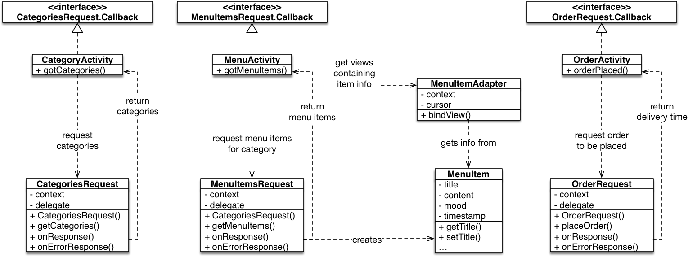

# Restaurant

## Objectives

- Practice with user interface design.
- Practice with presenting information in lists.
- Practice with online APIs with JSON.

## Background

Create an app that will help users look at a restaurant's menu and compose an order of items, as well as allow them to "submit" the order and receive an estimated waiting time for this order. Of course, they must be able to view the price of items, the total price of the order and be able to remove items from the order as well! All of this should be done using an elegant and simple user interface. Below you will find an idea of how this could look.

## Restaurant API

The API we will use for this assignment is available at: <https://resto.mprog.nl/>

The following **endpoints** are available:

* `/categories`: A GET request to this endpoint will return an array of strings of the categories in the menu. The array will be available under the key "categories" in the JSON.
* `/menu`: A GET request to this endpoint will return the full array of menu items, but it can also be combined with the query parameter, category, to return a subset of items. The array will be available under the key "items" in the JSON.
* `/order`: A POST to this endpoint will submit the order and will return a response with the estimated time before the order will be ready. 
* `/images`: Will return the URL of an image. Make sure to handle 404 errors correctly!

Tip: try the API in your webbrowser. Enter the address of the `categories` endpoint and see how it responds.

## Getting started

1.  Create a new Android studio project called **Journal**, using these settings:
    - Choose API 24 (Nougat) unless your own phone has an older operating system
    - Start with an Empty Activity which is called `CategoriesActivity` 
    - Leave all other settings unchanged

2.  Create a new, empty repository on the Github website. Name your repository `Restaurant`.

3.  Now, add a git repository to the project on your computer. Go to Android Studio, and in the menu choose **VCS -> Enable Version Control Integration**. Choose **git** as the type and confirm. This will not change much, but sets us up for the next steps.

    Note: if you get a popup to ask whether you would like to add some file to the repository, answer "No" for now. If you answer "Yes", things may get complicated later on.

4.  Link the local repository to your Github project. Choose **VCS -> Git -> Remotes...**. Add a remote with name "origin".

5.  Android Studio has generated quite a few files for your project already. To add these, let's **commit** and **push** those files to Github. Press **Cmd-K** or **Ctrl-K** to show the Commit Changes screen. There, you should see a long list of "unversioned files". Make sure all checkboxes are selected, enter a commit message `Initial project` and then press the **commit** button. Turn off code analysis.

6.  Press **Cmd-Shift-K** or **Ctrl-Shift-K** to show the Push Commits dialog. Press the **Push** button to send everything to Github.

Your project files should now be visible on Github. If not, ask for help!

## Architecture

Here's a general overview of the app architecture. There will be three activities, that all make a connection to our online API. There's also a model class for menu items, and an adapter for displaying those on the menu screen.

## Functional requirements

Your task is to build an app according to the description above. On top of that, there are some specific requirements to take into account:

- Your app should somehow display to the user the current amount of items in the order.

- Your app should persist the list of dishes in the order, even when quitting and re-opening the app.

## Technical requirements

- The app must properly display on devices of various dimensions.

- The app must properly support rotation of the user interface (no data loss).

- The app must use the concepts from the "Preparation" section, above.

- The app should use standard `ListViews` combined with an adapter.

- The app's back navigation should always be simple.

- `onClick` and similar listeners may not be "anonymous".

## 1. Showing categories

- First, add a simple List View to your `CategoriesActivity` user interface. Make sure it is well-positioned.

- Next, create a new class called `CategoriesRequest`, which will load the categories from the server.

    - The class needs a constructor that accepts a `Context` type parameter. Context is needed for sending the server request.

    - The request will be sent **asynchronously**, so we'll need a way to get back to whoever is trying to send a request. As the request is processed, we will call a method on the class that asked us to do this. This method will be predefined in an **interface**, which you need to place at the top of the `CategoriesRequest` class.

            public interface Callback {
                void gotCategories(ArrayList<String> categories);
                void gotCategoriesError(String message);
            }

    - public void getCategories(Callback activity)

        - new `RequestQueue` with the context

        - new `JsonObjectRequest` with the URL

    - **CTRL-O**, onResponse, onErrorResponse

    - `onResponse`: je zie in response een array met naam `"categories"`, maak een loop om de namen van deze categories in een `ArrayList<String>` te zetten. Roep `delegate.gotCategories` aan.

    - Catch de exception: als error, roep `delegate.gotCategoriesError` aan met `error.getMessage()`.

- Terug naar de activity. Voeg `implements CategoriesRequest.Callback` toe. **CTRL-O**. Voeg `gotCategories` en `gotCategoriesError` toe (helemaal onderaan).

    - In `gotCategories`, create a new `ArrayAdapter<String>` from the list of categories. Attach the adapter to your listview (remember how?).

    - In `gotCategoriesError`, create a `Toast` message showing the error to your user, so they know wat went wrong (hopefully).

Try out your app now! It should show the categories. Did something go wrong? Maybe you need to add an `INTERNET` permission to your app!

## 2. Showing the menu

When someone taps a category in the main screen, the app should load the menu items for that category. We'll use a new activity for this!

- Create `MenuActivity`. Add a list view.

- Now, first make a model class called `MenuItem` with the following fields. Create getters and setters for all fields (Alt+Ins or Ctrl+N).

    - ...
    - ...

- Just like you did for `CategoriesActivity`, create a request class that will retrieve the menu items for this category. Instead of retrieving a list of strings, make sure that the class provides us with an `ArrayList<MenuItem>`, with all the item fields properly filled from the JSON object.

- In your `CategoriesActivity`, implement `AdapterView.OnItemClickListener` and override (CTRL-O) the `onItemClick` method. In that method, open `MenuActivity` by way of an intent, making sure that you provide via `putExtra` a string with the category name.

- In your `MenuActivity`'s `onCreate`, retrieve the category string and make sure that this string is part of the request for menu items.

- Implement `MenuItemsRequest.Callback` and the `gotMenuItems` method. In this case, we would like to implement a **custom view** for the adapter, which will display as much info about the menu items as possible, including a picture!

Hopefully by now, your app will not only show categories, but menu items as well!

## 3. Showing the details

Now, when someone taps an item in the menu, we'd like to show a bit more detail. For this, we'll create a third activity.

- Create `MenuItemActivity`, with a nice layout for all information that we have about a `MenuItem`.

- Connect `MenuActivity` to the `MenuItemActivity` by adding an `OnItemClickListener` to the former's list view, and sending the right `MenuItem` via a `putExtra`.

- In the `MenuItemActivity`, make sure that all information is loaded from the `MenuItem` into the right UI controls.

Done!

## Tips

- Consider viewing the JSON from the server in a [JSON formatter](https://jsonformatter.curiousconcept.com/) to have a better overview of what data is present in the response.

- To use the JSON responses in your code and get the values you need, Android has some nifty built-in functionality on which you can find the docs [here](https://developer.android.com/reference/org/json/package-summary.html).

- To store the order in your app and make sure it persists after it has been killed, you can use `SharedPreferences`. `SharedPreferences` makes use of key-value pairs, so perhaps it could be useful to you to map the name of the dish (as a key) to the amount someone wants to order (the value), with the `putInt()` method. For more on `SharedPreferences`, refer to [this guide](/android/persistence).

- For some interaction with the API, you will need to use `POST` instead of `GET`. For this you can use the [Volley Library](https://developer.android.com/training/volley/simple.html) as well!

## Designing the user interface

How do you create a UI that fits well into the platform you're using? Peruse the interface guidelines and see. Check out the [Material Design Documentation](https://developer.android.com/design/index.html)
	- especially [the components section](https://material.google.com/components/bottom-navigation.html) (find more about lists, for example, in the sidebar)
	- and [the patterns section](https://material.google.com/patterns/confirmation-acknowledgement.html) (find more about navigation, for example, in the sidebar)

Each of these guides provides clear recommendations of how apps are supposed to look and behave for users. If apps behave consistently with other apps, this makes them easier to learn for the user. Make sure you use these guides to choose appropriate user interface elements; for example, how should a search function normally work on your platform?
