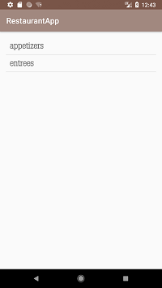
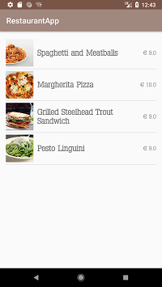
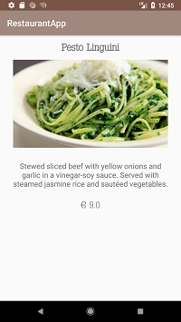
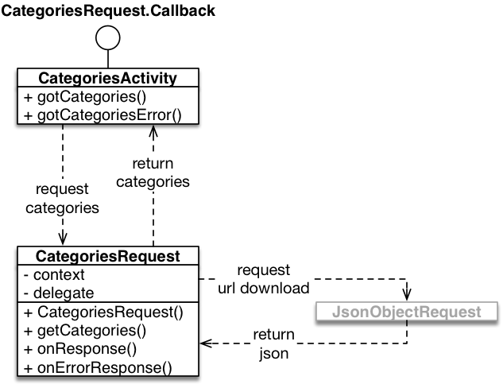
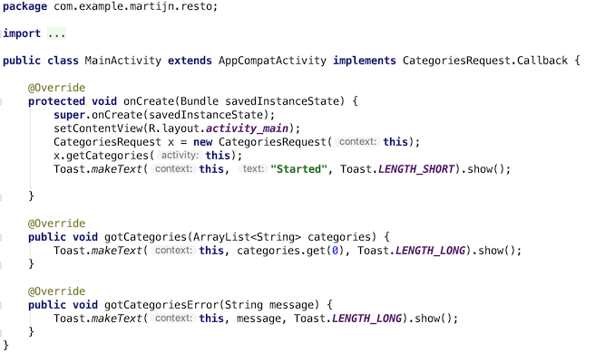

# Restaurant

## Objectives

- Practice with user interface design.
- Practice with presenting information in lists.
- Learn to use an `interface` to perform a callback.
- Practice using `Volley`.
- Practice with online APIs with JSON.

## Background

Create an app that will help users look at a restaurant's menu and view the details of the items in the menu. Of course, they must be able to view the price of items, the description and an image as well, all of which should be retrieved from an API. In order to communicate elegantly with the API, the code to do this will be contained in separate classes. This way the code that handles the UI will be separate from the code that retrieves data from the API. 

  

## Restaurant API

The API we will use for this assignment is available at: https://resto.mprog.nl/

The following **endpoints** are available:

* `/categories`: A GET request to this endpoint will return an array of strings of the categories in the menu. The array will be available under the key "categories" in the JSON.

    example: https://resto.mprog.nl/categories

* `/menu`: A GET request to this endpoint will return the full array of menu items, but it can also be combined with the query parameter, category, to return a subset of items. The array will be available under the key "items" in the JSON.

    example: https://resto.mprog.nl/menu?category=entrees

* `/order`: A POST request to this endpoint will submit the order and will return a response with the estimated time before the order will be ready.

    example: https://resto.mprog.nl/order (note: you can't try a POST request in the web browser)

<!--

* `/images`: Will return the URL of an image. Make sure to handle 404 errors correctly!

-->

## Getting started

1.  Create a new Android studio project called **Restaurant**, using these settings:
    - Choose API 24 (Nougat) unless your own phone has an older operating system
    - Start with an Empty Activity which is called `CategoriesActivity` 
    - Leave all other settings unchanged

2.  Create a new, empty repository on the Github website. Name your repository `Restaurant`.

3.  Now, add a git repository to the project on your computer. Go to Android Studio, and in the menu choose **VCS -> Enable Version Control Integration**. Choose **git** as the type and confirm. This will not change much, but sets us up for the next steps.

    Note: if you get a popup to ask whether you would like to add some file to the repository, answer "No" for now. If you answer "Yes", things may get complicated later on.

4.  Link the local repository to your Github project. Choose **VCS -> Git -> Remotes...**. Add a remote with name "origin".

5.  Android Studio has generated quite a few files for your project already. To add these, let's **commit** and **push** those files to Github. Press **Cmd-K** or **Ctrl-K** to show the Commit Changes screen. There, you should see a long list of "unversioned files". Make sure all checkboxes are selected, enter a commit message `Initial project` and then press the **commit** button. Turn off code analysis.

6.  Press **Cmd-Shift-K** or **Ctrl-Shift-K** to show the Push Commits dialog. Press the **Push** button to send everything to Github.

Your project files should now be visible on Github. If not, ask for help!

## Architecture

Here's a general overview of the app architecture. There will be three activities, two of which make a connection to the online API. There's also a model class for menu items, and an adapter for displaying those on the menu screen.

## Configuration

Add the Volley library to your project using [the instructions on this page](/android-reference/volley).

## 1. Showing categories

To prepare, add a simple ListView to your `CategoriesActivity` user interface. Make sure it is well-positioned. That's all there is to it! However, to make the app really work, we will need to fill the list with data from the restaurant server.

Have a look at the extended diagram below. What we'll be doing is create a specialized request class (`CategoriesRequest`), which downloads data from the server and transforms this to a nice list of strings. Downloading the data is delegated to a `JsonObjectRequest`, which is provided to us by the Android framework.

The general idea is that we should be able to create an object of type `CategoriesRequest`, and call its `getCategories()` method. This will start a download using an object of type `JsonObjectRequest`. Because downloading is never instantly, data is not instantly returned, but instead provided using a **callback method**. The `JsonObjectRequest` expects to be able to call these two callback methods:

- `onResponse(response)`, which is called when everything goes as expected, and the `response` parameter will contain a `JSONObject` containing the document

- `onErrorResponse(error)`, which is called when something goes awry, and the `error` parameter will contain a `VolleyError` containing, among other things, an error message

We'll use the same idea for our own `CategoriesRequest` class. It expects to be able two call either of two methods. These methods will be predefined in an **interface**, which you need to place at the top of the `CategoriesRequest` class.

- First, create a new Java class called `CategoriesRequest`

- Then, in the class, add the following interface declaration:

        public interface Callback {
            void gotCategories(ArrayList<String> categories);
            void gotCategoriesError(String message);
        }

Now, create the remaining parts of the `CategoriesRequest` class:

- Write a *constructor* that accepts a `Context` type parameter and stores it in a `context` instance variable. We need access to a "context" object to send internet requests.

- Define a method `void getCategories(Callback activity)`. This method will attempt to retrieve the categories from the API, and if succesful, will notify the activity that instantiated the request that it is done through the callback. This is why we pass a reference to the activity as an argument, so that when the API request is done, it knows which activity to notify.

    - Within this method, use [Volley](/android-reference/volley) to create a new `RequestQueue`, which takes the context we passed in the constructor as an argument. 

            RequestQueue queue = Volley.newRequestQueue(context);

    - Then we will want to create a `JsonObjectRequest`, since the data we want from the API comes in the shape of a JSON object. This can be done through the following lines of code:

            JsonObjectRequest jsonObjectRequest = new JsonObjectRequest(..., ..., ..., ...);
            queue.add(jsonObjectRequest);

    The `JsonObjectRequest` takes 4 arguments:

    - the url that the request should be submitted to (recall which URL?)
    - data that should be sent with the API call (in this case nothing, so `null`)
    - and two references to listeners that will handle the response; in this case, the same class will handle the responses, so use `this` to point this out
        
- To make sure that the class can handle the responses, `implement` the required interfaces:

        public class CategoriesRequest implements Response.Listener<JSONObject>, Response.ErrorListener

- Now use **CTRL+I** to generate the appropriate methods: `onErrorResponse()` and `onResponse()`. 

### Receiving and parsing data from the request

Now that the base code for the listener functionality is present, we still need to actually do something useful when we receive a response from the API. The data from the web server will be encoded in *JSON*, which can be interpreted using Java, but you'll have to do some conversion.

> When looking at JSON code from the Restaurant server (try it!), it will not be easily readable. You can use a JSON Formatter (there are many available on the web, just Google for it) to structure it and better understand the structure of the response.

In the case of the `categories` endpoint, the incoming data is an "object" (dictionary/hash) with a single element. That element's key is `"categories"` and its value is an "array" (list) of strings. We'd like to put those strings into a simple `ArrayList<String>`.

- In `onResponse()` you get immediate access to the top-level object. From that object, we'd like to extract the array named `"categories"`. Use the `response.getJSONArray()` method to do this.

- Once the JSON array is extracted, you can loop over it to extract the strings that are in it, and put those in an `ArrayList`. Use `getString(int position)` to extract each item. Need to know how many categories there are? Use `length()`.

- When the `ArrayList` has been filled, pass it back to the activity that wanted to have it. In the `getCategories` method, you got an `activity` parameter. Make sure this parameter is saved as an instance variable and then call `gotCategories()` on it from the `onResponse()` method.

With the steps above behind us, we now only report back to the calling activity when we successfully retrieve data from the API. However, because this is an internet connection, something could very well go wrong at some point. So, let's report an error in case it occurs!

- In the `onErrorResponse` method, use the reference to the activity to call the other method defined in the interface: `gotCategoriesError`. 

- Pass the description of the error as a string back to the activity through `gotCategoriesError`. Use `error.getMessage()` to get it. 

> When handling exceptions in apps, it's good to let your user know when something did not go as expected. It's not always needed to show them all the technical details of the error, but an app that silently fails and gives no feedback on what went wrong will be quite frustrating to use. 

### Getting the data into the activity

Theoretically, the `CategoriesRequest` can now be used to retrieve data from the Restaurant server. It will be returned as a simple `ArrayList`. Let's try to do this from the main activity.

- Add `implements CategoriesRequest.Callback` to the class declaration of `CategoriesActivity`. Red wriggly lines now appear, so hit `CTRL+I` to implement the methods that are defined in the `Callback` interface: `gotCategories()` and `gotCategoriesError()`

First off, try out your classes using simple Toast messages (pop-ups) on the screen. Here's an example:

If everything works correctly, it should display the name of the first category on the screen. Then, create a list view with an `ArrayAdapter` and feed it the `ArrayList`, so all (two) categories will be displayed nicely (remember how to create list views?).

Did something go wrong? Maybe you forgot to add `INTERNET` permission to your app!

## 2. Showing the menu

When someone taps a category in the main screen, the app should load the menu items for that category. We'll use a new activity for this!

- Create `MenuActivity`. Add a ListView.

- Now, first make a model class called `MenuItem` with the following fields. Create getters and setters for all fields (`Alt+Ins` or `Ctrl+N`).

    - name
    - description
    - imageUrl
    - price
    - category

- Just like you did for `CategoriesActivity`, create a request class that will retrieve the menu items for this category. Instead of retrieving a list of strings, make sure that the class provides us with an `ArrayList<MenuItem>`, with all the item fields properly filled from the JSON object.

- In your `CategoriesActivity`, implement `AdapterView.OnItemClickListener` and override (CTRL-O) the `onItemClick` method. In that method, open `MenuActivity` by way of an intent, making sure that you provide via `putExtra` a string with the category name.

- In your `MenuActivity`'s `onCreate`, retrieve the category string and make sure that this string is part of the request for menu items.

- Implement `MenuItemsRequest.Callback` and the `gotMenuItems` method. In this case, we would like to implement a **custom view** for the adapter, which will display as much info about the menu items as possible, including a picture!

Hopefully by now, your app will not only show categories, but menu items as well!

## 3. Showing the details

Now, when someone taps an item in the menu, we'd like to show a bit more detail. For this, we'll create a third activity.

- Create `MenuItemActivity`, with a nice layout for all information that we have about a `MenuItem`.

- Connect `MenuActivity` to the `MenuItemActivity` by adding an `OnItemClickListener` to the former's list view, and sending the right `MenuItem` via a `putExtra`.

- In the `MenuItemActivity`, make sure that all information is loaded from the `MenuItem` into the right UI controls.

Done!

## Tips

- Consider viewing the JSON from the server in a [JSON formatter](https://jsonformatter.curiousconcept.com/) to have a better overview of what data is present in the response.

- To use the JSON responses in your code and get the values you need, Android has some nifty built-in functionality on which you can find the docs [here](https://developer.android.com/reference/org/json/package-summary.html).

## Designing the user interface

How do you create a UI that fits well into the platform you're using? Peruse the interface guidelines and see. Check out the [Material Design Documentation](https://developer.android.com/design/index.html)
	- especially [the components section](https://material.google.com/components/bottom-navigation.html) (find more about lists, for example, in the sidebar)
	- and [the patterns section](https://material.google.com/patterns/confirmation-acknowledgement.html) (find more about navigation, for example, in the sidebar)

Each of these guides provides clear recommendations of how apps are supposed to look and behave for users. If apps behave consistently with other apps, this makes them easier to learn for the user. Make sure you use these guides to choose appropriate user interface elements; for example, how should a search function normally work on your platform?
