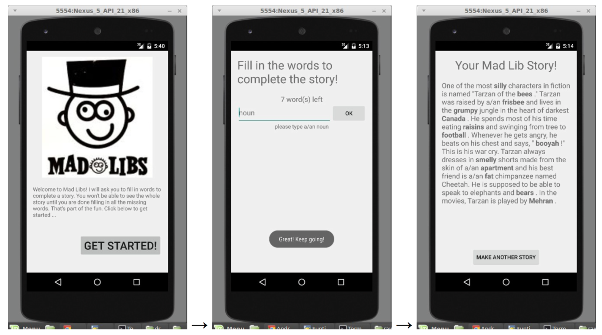

# Multiple Screens

*Due: Sunday night, April 24, 2016.*

## Objectives

- File reading
- Pass data between Activities
- Support multiple screen rotations

The purpose of this assignment is to practice the material from the past few weeks, such as apps with multiple screens, apps that handle instance state and data.

## Preparation

- On Android: Read about [Multiple Activities](/android/multiple-activities)
- On iOS: Read about [Multiple Controllers](/ios/multiple-controllers)

## Assessment

Your work on this problem set will be evaluated along four axes primarily.

Scope
: To what extent does your code implement the features required by our specification?

Correctness
: To what extent is your code consistent with our specifications and free of bugs?

Design
: To what extent is your code written well (i.e., clearly, efficiently, elegantly, and/or logically)?

Style
: To what extent is your code readable (i.e., commented and indented with variables aptly named)?

All students must ordinarily submit this and all other problem sets to be eligible for a satisfactory grade unless granted an exception in writing by the course’s heads.

## Mad Libs

"Mad Libs" are short stories that have blanks called placeholders to be filled in. In the non-computerized version of this game, one person asks a second person to fill in each of the placeholders without the second person knowing the overall story. Once all placeholders are filled in, the second person is shown the resulting silly story.

Write an app that reads in a Mad Lib from a text file in a specific format. The text file represents placeholders as tokens that start and end with `<` `>` brackets, like `<adjective>` or `<proper-noun>`.

Once the user has typed in replacements for all these placeholders, the completed story is shown on the screen.

The screenshots below indicate a possible flow of the UI for such an app. Our flow has three activities: An initial "welcome" screen explaining the app, then a screen that repeatedly prompts the user to fill in placeholders, then a third activity to display the completed story. Of course you don't need to exactly match our sample's UI, but it may give you ideas.

Here is the text of **madlib1_tarzan.txt**, to give you an idea of the Mad Lib format:

    One of the most <adjective> characters in fiction is named "Tarzan of the
    <plural-noun> ." Tarzan was raised by a/an <noun> and lives in the
    <adjective> jungle in the heart of darkest <place> . He spends most of his
    time eating <plural-noun> and swinging from tree to <noun> . Whenever he
    gets angry, he beats on his chest and says, " <funny-noise> !" This is his
    war cry. Tarzan always dresses in <adjective> shorts made from the skin of
    a/an <noun> and his best friend is a/an <adjective> chimpanzee named
    Cheetah. He is supposed to be able to speak to elephants and <plural-noun>
    . In the movies, Tarzan is played by <person's-name> .

The code for reading the story text file, breaking it apart, looking for the placeholders, etc. is not part of the assignment. To make the assignment more manageable, if you want a head start toward implementing this particular option, we'll give you a file (see below) that you can optionally use as a building block (recommended). If you put the **Story class** into your project, you can construct a `Story` object and pass it an *input stream or Scanner* and it will read the text data from that source, break the text apart, and find the placeholders for you, etc. The Story object has other methods for filling in the placeholders later. If you use this helper object, you can focus more on the important parts of this assignment and less on the string / text processing parts. Or if you want to try to write the story parsing logic yourself, that is fine.

**of geven we hier te veel weg?**

[files for Android](madlibs-files.zip) , [files for iOS](????)

## Requirements

Your task is to build an app according to the description above. On top of that, there are some specific requirements to take into account:

- Your app should read a file and look for placeholders as specified above.

- Your app should prompt for user input and use that input to complete the story.

- Your app should support rotation of the user interface, just like last week.

## Getting started

1. Create a new empty GitHub repository.

2. Create a new project, using this pattern as a name: `studentname-pset1`.

3. Download the provided files and paste them into your project (recommended).  

## Implementation details (Android)

To pass stuff around in your app, you can use an `Intent`. The Android documentation provides a brief tutorial on this. For back navigation in your app, you should use the hardware back button, not implement one in the UI.

## Implementation details (iOS)

Hier gaat Julian iets vet gaafs schrijven, joe.

## How to submit

1. Add a `README.md` with screenshot and a brief description. Use Markdown to format your README, as supported by GitHub. The screenshot must be uploaded to your GitHub repository first! Do that nice and clean in a separate folder called `doc`.

2. Commit and push one last time (hopefully!).

3. Check if your project actually works for other developers! Go to the GitHub webpage for your repository and use the "Download zip" button. Unpack that zip somewhere unusual (your Desktop maybe?) and try to open and run the project.

4. When all is set, paste the GitHub repo URL below, in the textbox!
