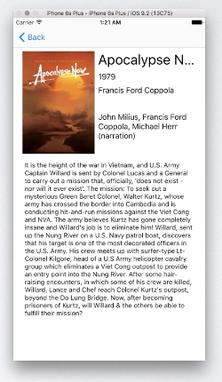

# Watch List

*Due: Monday, 26 September 2016 at 13:00.*

## Objectives

- Practice with user interface design.
- Practice with online APIs.

## Preparation

- On Android: Read about [Multiple Activities](/android/multiple-activities).
- On iOS: Read about [Multiple Controllers](/ios/multiple-controllers).

## Assessment

Your work on this problem set will be evaluated along two axes primarily.

Scope
: To what extent does your code implement the features required by our specification?

Correctness
: To what extent is your code consistent with our specifications and free of bugs?

All students must ordinarily submit this and all other problem sets to be eligible for a satisfactory grade unless granted an exception in writing by the course's heads.

## Peer Assessment

In additional to the above, your work will also be reviewed by a fellow student. To do this, pair up with one other student, and provide each other with tips to enhance the design and style of your code. Add the results in a file called **REVIEW.md** in your code repository.

Design
: To what extent is your code written well (i.e., clearly, efficiently, elegantly, and/or logically)?

Style
: To what extent is your code readable (i.e., commented and indented with variables aptly named)?

## Helpful reminders

Remember that movie? It came out last year and you really really wanted to see it, and up until now, you totally forgot to watch it. A perfect problem to tackle with a small but powerful app!

Create an app that will help users remind which movies to watch and present this in a simple, elegant user interface. Users should be able to search for movies, read descriptions and view poster art, as well as add such titles to a list of movies to watch. And of course, they should be able to remove titles from the list as well!

But where do you get these movie titles, descriptions and poster art? There's a great resource for that: the [OMDb API](http://omdbapi.com). Make sure your app works by getting information from this API. 

## Designing the user interface

How do you create a UI that fits well into the platform you're using? Peruse the interface guidelines and see:

- For iPhone, check out the [iOS Human Interface Guidelines](https://developer.apple.com/ios/human-interface-guidelines/)

- For Android, check out the [Material Design Documentation](https://developer.android.com/design/index.html)

Each of these guides provides clear recommendations of how apps are supposed to look and behave for users. If apps behave consistently with other apps, this makes them easier to learn for the user. Make sure you use these guides to choose appropriate user interface elements; for example, how should a search function normally work on your platform?

## Requirements

Your task is to build an app according to the description above. On top of that, there are some specific requirements to take into account:

- Your app should support rotation of the user interface.

- Your app should use standard list views combined with an adapter (Android) or delegation (iOS).

- Your app should save and persist the list of movies using ... (Android) or `NSUserDefaults` (iOS).

- The app's back navigation should always be simple.

- No need to use the API in an efficient manner. Normally, you would cache all data that you get from the API, so not to overload it with duplicate requests as your user browses the app. For now, you can simply request the data again whenever you need it!

## Getting started

1. For iOS: create an empty [GitHub](https://www.github.com/) repository to manage your code.

2. Create a new project, using this pattern as a name: `studentname-pset2`.

3. Share your project on GitHub. 

4. Remember to commit and push all important changes you make! 

## Tips (Android)

To pass stuff around in your app, you should use an `Intent`. The Android documentation provides a brief tutorial on this. For back navigation in your app, you should use the hardware back button, not implement one in the UI.

When creating an instance of the `Story` class you should have already opened the appropriate text file. Pass a `Scanner` object to the constructor of the `Story` class.

## Tips (iOS)

To pass stuff around in your app, you can use the 'prepareForSegue' method. For back navigation in your app, you should use a navigation controller.

When creating an instance of the `Story` class you should have already opened the appropriate text file. Pass a `String` object to the constructor of the `Story` class.

## How to submit

1. Add a `README.md` with screenshot and a brief description. Use Markdown to format your README, as supported by GitHub. The screenshot must be uploaded to your GitHub repository first! Do that nice and clean in a separate folder called `doc`.

2. Commit and push one last time (hopefully!).

3. Check if your project actually works for other developers! Go to the GitHub webpage for your repository and use the "Download zip" button. Unpack that zip somewhere unusual (your Desktop maybe?) and try to open and run the project.

4. When all is set, paste the GitHub repo URL in the textbox, below!
