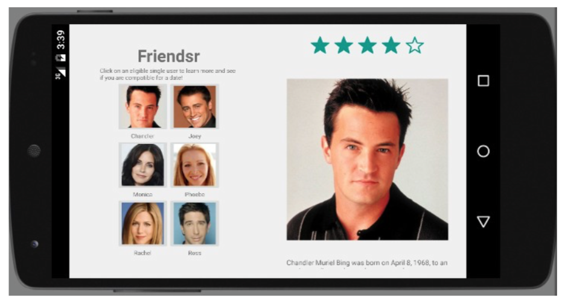

# Lists

The purpose of this assignment is to practice the material from the past few weeks, such as apps that display lists, read data from files, perform text-to-speech or speech-to-text operations, and/or use fragments. As with past assignments, we'll suggest some ideas for programs you could write to practice layout. We will list several suggestions, but you only need to write one app to submit.

If you have a different idea for a program you want to make that will still allow you to explore these topics, please feel free to do something other than the suggestions provided. Another great option would be to revisit one of your past assignments and add features to them that use the new material, and re-submit that. As long as you try to follow the constraints described in this document (see the "make up your own" section later), you will receive credit even if your submission is just an enhanced version of a previous submission.

Your submission will be graded quickly by simply running it and evaluating its functionality. It does not need to be perfect or bug-free to receive credit. Your code will not be graded on style, but we still encourage you to follow good overall coding style for your own sake. If you want to see some good examples of proper Java coding style, consult the Style Guide linked from the Homework web page.

## Suggestion 0: Make Up Your Own

If you don't like our suggested assignment ideas listed on the following pages of this document, or if you prefer to do something unique of your own, please feel free to do so. Whether you do our suggestions or your own, we'd prefer to see an app that has the following qualities:

- Your app should be set up as either an Android Studio or an Xcode project, so it can easily be opened/run/graded by others.
- Your app should use at least 2 different activities/view controllers or at least 2 fragments.
- At least one of the controllers should incorporate a list!
- Your app should gracefully handle rotation from portrait to landscape orientation.
- Along with your app, please turn in a file named **README.md** that contains your name and e-mail address along with the name of your app and a very brief description of it, along with any special instructions that the user might need to know in order to use it properly (if there are any). For example:

        Joe Student <jstudent@stanford.edu>
        NumberGame 2.05 - This app shows two numbers on the screen and asks
        the user to pick the larger number.  Perfect for Berkeley students!

As always, these assignments, as well as this class in general, are meant to be low-stress and fun. If you want help, please feel free to show your code to others or ask for help in our online Piazza forum. Feel free to make an app as simple or as complex as you like, relative to your familiarity level and time constraints. If you work on your solution for roughly 2 hours and are still not done, you can turn it in and we will award you credit.

## Suggestion 1: To-Do List

Write a simple to-do list app that has a `ListView` of tasks that the user needs to complete. Initially the app is empty and has nothing in the to-do list. But if the user types text into a bottom `EditText` and clicks an Add button, the new item will be added to the top or bottom of the list.

It's also good to have a way to remove items from the list. You could achieve this by attaching a listener to the list that removes an item when that item is clicked on by the user. Or if you want to try something slightly different, try making it remove an item when the user performs a "long click" (pressing and holding the mouse on an item). You can do this by calling the `setOnItemLongClickListener` method of your list and passing an anonymous `AdapterView.OnItemLongClickListener` class. Android Studio can help you auto-generate the skeletons of these anonymous listener classes if you press *Ctrl-Space* in the editor at the right place in the code.

Figure: User long-clicking on second list item to delete it

If the items in your to-do list are stored into an `ArrayList`, by default the app's GUI won't notice when you add or remove an item from the list. That is, you'll modify the `ArrayList` state but the graphical list on the screen won't update to match.

To fix this, you have to call the method `notifyDataSetChanged()` on your `ArrayAdapter` to tell it that the underlying array list has changed. To be able to do this, of course, you'll have to save your `ArrayList` and your `ArrayAdapter` as private fields inside your activity.

Make sure that the app doesn't forget your to-do items when you rotate the screen back and forth from portrait to landscape mode. To make a more robust app, you should also consider saving the state of the to-do list when the app is exited and re-entered later. Use a `Bundle` to save the list's data. If you want to make the app as robust as possible, you'd want to make it also save the to-do list to the device's storage so that it will survive a reboot. To do this, you'd need to write code that reads/writes files to the system's internal storage:

    // write to a file
    PrintStream out = new PrintStream(openFileOutput("filename.txt", MODE_PRIVATE));
    out.println(text);
    out.close();
    
    // read a file
    Scanner scan = new Scanner(openFileInput("filename.txt"));
    while (scan.hasNextLine()) {
        String line = scan.nextLine();
        do something with line;
    }

If you want to add text-to-speech to this app, such as making it read the to-do list aloud, please feel free to do so.

## Suggestion 2: Talking Mad Libs

This suggestion is only practical if you did the "Mad Libs" program in a previous assignment. This time, improve the program by adding features we've just learned. Here are the kinds of features to add:

- Provide an initial list as a ListView (or drop-down list, represented by a Spinner) that shows all the mad lib files (such as `madlib1_tarzan.txt`, `madlib2_university.txt`) and lets the user pick one by clicking on the list.

- Use text-to-speech so that in addition to showing prompts as text, like "Please type an adjective," the program will also speak those prompts aloud ([iOS AVSpeechSynthesizer](https://developer.apple.com/library/ios/documentation/AVFoundation/Reference/AVSpeechSynthesizer_Ref/index.html)).

- Add a "Talk" button that uses speech-to-text so that you can speak your word rather than typing it manually using the Android keyboard.

If you didn't do Mad Libs previously, you can still do this option, but you'd need to implement the Mad Libs assignment first, which might take too much time. It's up to you.

## Suggestion 3: Friendsr with Fragments or Size Classes

This one can only be done when agreed upon by the teacher!

If you previously did the Friendsr dating app, modify it to use fragments (Android) or [size classes](https://developer.apple.com/library/ios/recipes/xcode_help-IB_adaptive_sizes/chapters/AboutAdaptiveSizeDesign.html) (iOS) so that when the screen is rotated into landscape orientation, it shows the details about the user in the same activity, rather than jumping into a new activity. When the app is in portrait mode, it should follow the old behavior of having the user list and user details be separate activities.

