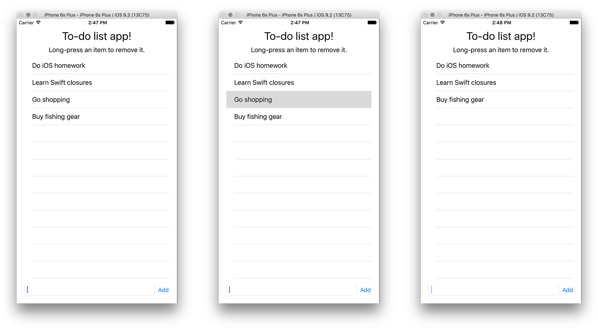

## iOS

Write a simple to-do list app that has a `Table View` of tasks that the user needs to complete. Initially the app is empty and has nothing in the to-do list. But if the user types text into a bottom `Text Field` and clicks an Add button, the new item will be added to the top or bottom of the list.

It's also good to have a way to remove items from the list. You could achieve this with the `commitEditingStyle` delegate function. 

Figure: User swiping on the third list item to delete it.

Make sure you connect your table view with the datasource and delegate from the Storyboard to your Swift-file. 

You must make the app as robust as possible, so make it save the to-do list to the device's storage so that it will survive a reboot. To do this, you'd need to write code that reads/writes files to the system's internal storage. We've provided this standard code, so improve this code and make sure you do *proper error handling*.

    if let directory: String = NSSearchPathForDirectoriesInDomains(NSSearchPathDirectory.DocumentDirectory, NSSearchPathDomainMask.AllDomainsMask, true).first {
        
        let path: String = directory + "test.txt"
        
        // Writing.
        do {
            try text.writeToFile(path, atomically: false, encoding: NSUTF8StringEncoding)
        }
        catch {
            // Error handling here.
        }
        
        // Reading.
        do {
            text2 = try String(contentsOfFile: path, encoding: NSUTF8StringEncoding)
        } catch {
            // Error handling here.
        }
    } else {
        // Error handling here.
    }

To split a textfile into an array of strings, use this code. Make sure you understand it by reading the [Apple documentation on closures](https://developer.apple.com/library/prerelease/ios/documentation/Swift/Conceptual/Swift_Programming_Language/Closures.html "Closures")! And for further information on map() (and flatMap()) read this blog post on ["What do map() and flatMap() really do?"](http://sketchytech.blogspot.nl/2015/06/swift-what-do-map-and-flatmap-really-do.html "map()")!. 

	let textArray = text.characters.split{$0 == " " || $0 == "\r\n"}.map(String.init)

Be sure to return an optional when the reading/writing fails and handle the problem in a proper way. 
