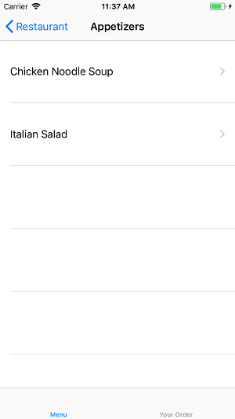

# Track List

## Objectives

- Practice with user interface design.
- Practice with asynchronous code.
- Practice with online APIs.

## Preparation

- On Android: [Persistence](/android/persistence) and [Lists](/android/lists).

## Assessment
Your work on this problem set will be checked for full completion of the assignment and consideration of all requirements. Demo your application during office hours.

All students must ordinarily submit this and all other projects to be eligible for a satisfactory grade unless granted an exception in writing by the course's heads.

## What to do
Create an app that will help users look at a restaurant's menu and compose an order of items, as well as allow them to "submit" the order and receive an estimated waiting time for this order. Of course, they must be able to view the price of items, the total price of the order and be able to remove items from the order as well! All of this should be done using an elegant and simple user interface. Below you will find an idea of how this could look.

  

## API
The API we will use for this assignment is available at: [https://resto.mprog.nl/](https://resto.mprog.nl/)

The following endpoints are available in this API:

* `/categories`: A GET request to this endpoint will return an array of strings of the categories in the menu. The array will be available under the key, "categories," in the JSON.
* `/menu`: A GET request to this endpoint will return the full array of menu items, but it can also be combined with the query parameter, category, to return a subset of items. The array will be available under the key, "items," with the JSON.
* `/order`: A POST to this endpoint with the collection of menu item id values will submit the order and will return a response with the estimated time before the order will be ready. The IDs you send need to be be contained with JSON data under the key, menuIds. When you parse the JSON, an estimate of the time before the order is ready will be under the key, "preparation_time".
* `/images`: Will return the URL of an image, if available. Make sure to check for 404's!

### Setting up a connection with the API

To set up a connection with the API, we will make use of the [Volley Library](https://developer.android.com/training/volley/index.html) for Android. To make this work you will need to add a dependency to your app's `build.gradle` file, as per so: `compile 'com.android.volley:volley:1.0.0'` This will allow you to use the libary's functionalities in your app. You can follow the guide and example code on using a `newRequestQueue` on [this](https://developer.android.com/training/volley/simple.html) in order to set up your connection with the API. If everything goes well, you can now do something useful with your API response in the `onResponse` method!

## Designing the user interface

How do you create a UI that fits well into the platform you're using? Peruse the interface guidelines and see. For Android, check out the [Material Design Documentation](https://developer.android.com/design/index.html)
	- especially [the components section](https://material.google.com/components/bottom-navigation.html) (find more about lists, for example, in the sidebar)
	- and [the patterns section](https://material.google.com/patterns/confirmation-acknowledgement.html) (find more about navigation, for example, in the sidebar)

Each of these guides provides clear recommendations of how apps are supposed to look and behave for users. If apps behave consistently with other apps, this makes them easier to learn for the user. Make sure you use these guides to choose appropriate user interface elements; for example, how should a search function normally work on your platform?

## Requirements

Your task is to build an app according to the description above. On top of that, there are some specific requirements to take into account:

- Your app should properly display on devices of various dimensions.

- Your app should properly support rotation of the user interface (no data loss).

- Your app's back navigation should always be simple.

- Your app should use standard list views combined with an adapter.

- Your app should save and persist the list of dishes in the order using `SharedPreferences`.

- Listeners may not be anonymous as of now, see the [resource about Listeners](/android/listeners).

## Getting started

1. Create an empty [GitHub](https://www.github.com/) repository to manage your code.

2. Create a new project, using this pattern as a name: `studentname-pset3`.

3. Share your project on GitHub.

4. Remember to commit and push all important changes you make!

## Tips

- If you need to handle events other than `onClick`, you might need to implement a listener class. Do not use an anonymous listener class (as is often used on Stack Overflow)! Instead, use a named listener class. [Here's an example](http://www.fredosaurus.com/notes-java/GUI/events/inner_class_listener.html).

## How to submit

1. Add a `README.md` with screenshot and a brief description. Use Markdown to format your README, as supported by GitHub. The screenshot must be uploaded to your GitHub repository first! Do that nice and clean in a separate folder called `doc`.

2. Commit and push one last time (hopefully!).

3. Check if your project actually works for other developers! Go to the GitHub webpage for your repository and use the "Download zip" button. Unpack that zip somewhere unusual (your Desktop maybe?) and try to open and run the project.

4. When all is set, paste the GitHub repo URL in the textbox, below!
