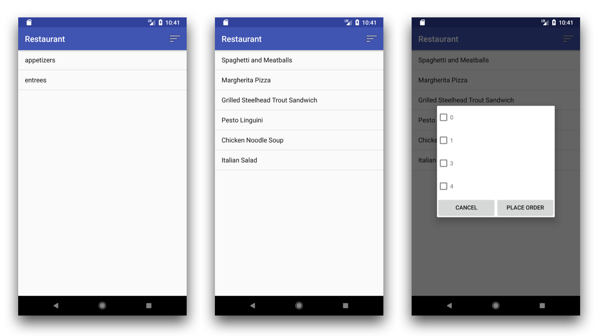

# Restaurant Revisited

## Objectives

- Practice with user interface design.
- Practice with presenting information in fragments.
- Practice with online APIs with JSON.
- Practice with storing more complex data in SQLite.

## Preparation

Guides available from the first implementation of Restaurant:

- Learn about [Listeners](/android/listeners).
- Learn about [Lists](/android/lists).
- Learn about [Volley](/android/volley).

Guides specifically for Restaurant Revisited:

- Learn about [SQLite](/android/sqlite)
- Learn about [Fragments](/android/fragments)

## Assessment

Your work on this problem set will be checked for full completion of the assignment and consideration of all requirements. Demo your application during office hours.

All students must ordinarily submit this and all other projects to be eligible for a satisfactory grade unless granted an exception in writing by the course's heads.

## What to do

Create an app that will help users look at a restaurant's menu and compose an order of items, as well as allow them to "submit" the order and receive an estimated waiting time for this order. Of course, they must be able to view the price of items and the total price of the order! All of this should be done using an elegant and simple user interface.

## Requirements  

- Your app should work and look like in the description and the screen shots above.
- Your app should have simple but elegant layouts that work well on a variety of phone sizes.
- Your app should be made according to the steps below.

<!--
1. New project with Blank Activity
2. Add CategoriesFragment based on ListFragment.
3. Use Volley to load categories from website, connect to list with `this.setListAdapter()`.
4. Prepare `MainActivity` for first fragment:

        getFragmentManager()
                .beginTransaction()
                .replace(R.id.fragment_container, new CategoriesFragment())
                .commit();
5. Create MenuFragment based on ListFragement for showing menu based on category.
6. Override onListItemClick for CategoriesFragment to go to MenuFragment:

        MenuFragment menuFragment = new MenuFragment();
        Bundle args = new Bundle();
        args.putString("category", s);
        menuFragment.setArguments(args);

        getFragmentManager()
                .beginTransaction()
                .replace(R.id.fragment_container, menuFragment)
                .addToBackStack(null)
                .commit();
7. Use Volley to load menu from website.
8. Add `OrderFragment` inheriting from `DialogFragment` for showing order.
9. Add OptionsMenu to the `MainActivity`:

        public boolean onCreateOptionsMenu(Menu menu) {
            MenuInflater inflater = getMenuInflater();
            inflater.inflate(R.menu.actions, menu);
            return super.onCreateOptionsMenu(menu);
        }
        public boolean onOptionsItemSelected(MenuItem item) {
            switch (item.getItemId()) {
                case R.id.place_order:
                    ...
            }
        }
10. Handle clicking **cancel** in `OrderFragment`:

        Button b = (Button) v.findViewById(R.id.cancel_button);
        b.setOnClickListener(this);

        @Override
        public void onClick(View view) {
            switch (view.getId()) {
                ...
            }
        }
4. Add OrderDatabase and OrderAdapter like in the TodoApp.
5. Allow adding items to order in MenuFragment.
6. Allow placing order and clearing db in OrderFragment.
-->

## Step 1: Getting started

Tip: keep your previous code of Restaurant close, if you have it! You are allowed to reuse your previously implemented functionality. However, you must start a new project for this new version.

- Create a new empty GitHub repository.
- Create a new Android studio project, starting with a blank activity.
- Link your project to the repository.

## Step 2: Displaying categories

If you haven't read the guide on `Fragments` yet, you can find it [here](/android/fragments). Android ships with a couple of specialized `Fragment` subclasses. In this case, we'll use a `ListFragment` to show the menu categories, like in our earlier Restaurant app.

- Create a fragment class called `CategoriesFragment`, go to **File > New > Fragment > Fragment (Blank)** and uncheck the boxes for "Include fragment factory methods" and "Interface Callbacks". (Do not use Fragment (List), or you end up with mountains of pre-generated but hard to understand code.)

You should have a `Fragment` class with a constructor and `onCreateView()`, and also a layout XML file associated with your newly created fragment. Take a quick look at your newly generated code and read through the comments to get some idea of what you still have to do.

- Delete the empty constructor for this `Fragment`. According to the documentation, fragments should have no constructors.
- Now, change the class to a `ListFragment` by changing `extends Fragment` to `extends ListFragment` in the class declaration.

Important note: when adding imports using Android Studio, choose `android.app.ListFragment` instead of `android.support.v4.app.ListFragment`. The latter is used for backwards compatibility, when running apps on very old phones. We'll keep it simple and use the "modern" fragments.

- A `ListFragment` depends on the existence of a list view in the layout file, so add a list view to `fragment_categories.xml`. Make sure to assign `android:list` as the identifier of the list view.
- Use CTRL-O to override the `onCreate()` method.
- In `onCreate()`, add code based on the Volley library to load the categories from the <https://resto.mprog.nl> web server.
- In a `ListFragment`, you must use the `this.setListAdapter()` method to connect an adapter to the list. Do not attach it to the list directly, as you did in a previous version of the Restaurant app, because in this case, the `ListFragment` is responsible for making sure everything stays in sync.

## Step 3: Connect the initial fragment to the activity

`MainActivity` needs some simple changes to accommodate showing fragments.

- Open `activity_main.xml` in **Text** mode. In the XML, change the `ConstraintLayout` tag to a `FrameLayout` (that kind of layout is ideally suited for displaying just a single element, in this case the fragments).
- Now switch to **Design** mode, select the `FrameLayout` in the preview, and assign it the ID `fragment_container`.

In your `MainActivity`'s `onCreate()` method, we will now attach our `Fragment` to the activity. To do this, Android provides a **fragment manager**, which allows adding and replacing fragments, while keeping track of all fragments using tags.

<!-- checking for fragment_container using findViewById is not needed if we are certain it's there -->

- In the `onCreate()` method of `MainActivity`, use the fragment manager to load the fragment:

        FragmentManager fm = getFragmentManager();
        YourFragmentClass fragment = new YourFragmentClass();
        FragmentTransaction ft = fm.beginTransaction();
        ft.replace(R.id.fragment_container, fragment, "categories");
        ft.commit();

Your app should now work! Try it out and ask for help debugging if needed.

## Step 4: Displaying the menu

Add another fragment called `MenuFragment`, using the steps outlined earlier. Make sure it can load the menu items from the server (in the next step, we'll explain how to pass the menu category from the first activity to the second).

## Step 5: Linking from a category to the menu

Use CTRL-O to override the `onListItemClick` method in `CategoriesFragment`. Use the following code to go to `MenuFragment`, and pass on the category that was clicked by adding it to a `Bundle`, and setting this bundle as the arguments of `MenuFragment`:

    MenuFragment menuFragment = new MenuFragment();
    
    Bundle args = new Bundle();
    args.putString("category", s);
    menuFragment.setArguments(args);

    getFragmentManager()
            .beginTransaction()
            .replace(R.id.fragment_container, menuFragment)
            .addToBackStack(null)
            .commit();

See that code for replacing the fragment? It's almost the same as in step 2, but this time we use the promise interface, which allows us to chain all methods to each other, without creating all those temporary variables. Also, we added a call to `addToBackStack()`, which makes sure that our users can use their phones' back buttons to navigate back.

In `MenuFragment`, override `onCreate()`. You can get access to the bundle using this line:

    Bundle arguments = this.getArguments();

Use that bundle to load the right menu items. Try your app to make sure everything works as expected!

## Step 6: Add the order overview fragment

For presenting the final order to the user, we'll use a **dialog fragment**, as shown in the third screen shot above. Unfortunately, there is no fragment type that combines the dialog functionality with that of a list view, so we'll need to handle this list view manually.

- Add a new class `OrderFragment`. Change it into a `DialogFragment`.
- Create the layout for this fragment. Don't forget to assign an ID to the list view.

## Step 7: Add a button to the action bar to show the order

The Android action bar has plenty of space to show an "order overview" button. To add such a button, first create a menu resource file:

- Go to **File > New > Android Resource File**.
- Use `actions` as the file name and **menu** as the resource type. Press OK.
- Add a Menu Item to the menu, and give it an `id`, `title` and choose an appropriate icon.
- For `showAsAction`, choose `always`.

You can load this menu resource by overriding `onCreateOptionsMenu` in the `MainActivity`:

    public boolean onCreateOptionsMenu(Menu menu) {
        MenuInflater inflater = getMenuInflater();
        inflater.inflate(R.menu.actions, menu);
        return super.onCreateOptionsMenu(menu);
    }

To handle events for the menu, override `onOptionsItemSelected`:

    public boolean onOptionsItemSelected(MenuItem item) {
        switch (item.getItemId()) {
            case R.id.place_order:
                ...
        }
    }

Now, our order overview is a special type of fragment, which will not **replace** the menu fragment, but instead will be shown on top of it. To show a dialog fragment, use the following code:

    FragmentTransaction ft = getFragmentManager().beginTransaction();
    OrderFragment fragment = new OrderFragment();
    fragment.show(ft, "dialog");

Try out your app and make sure the order summary shows up! You can dismiss the fragment by tapping outside of it.

## Step 8: Create the database classes

To store our users' orders, we will use a [SQLite][/android/sqlite] table. This allows us to store the relevant data: id, name, price and amount ordered.

Create `RestoDatabase` and `RestoAdapter` classes like you did in the To-Do List app. The methods in the database class may be a little different:

- We'd like to have an `addItem()` method that adds one dish to the order (saving name, price etc.). But if the dish is already in the order, it just has to increment the amount already in the database.
- We'd like to have a `clear()` method that removes all order items from the database.

## Step 9: Wire up the database

- Override `onListItemClick` in the `MenuFragment` and call the database to add the item to the order.
- Override `onViewStateRestored` in the `OrderFragment` to get all items from the database and link an `OrderAdapter` to the list view.

Check if the list is loading correctly!

## Step 10: Allow submitting the order

As a final step for creating the functionality, we need to add handlers for the "Cancel" and "Place order" buttons in the `OrderFragment`.

- Add `implements View.OnClickListener` to the class definition.
- In the `onCreateView()` method, assign the class as the click listener for the cancel button:

        Button b = (Button) v.findViewById(R.id.cancel_button);
        b.setOnClickListener(this);

- Do the same for the place order button.
- Create the event handler method:

        @Override
        public void onClick(View view) {
            switch (view.getId()) {
                case ...
            }
        }
- Think about what steps need to be taken when a user clicks the "Place order" button.

## Step 11: Clean up your code

- Make sure there are no anonymous listeners in your code.
- Add comments to your code.
- Delete any empty methods.

## Step 12: Better Code Hub

If everything is in order, the code that you wrote should be pretty simple! A couple of classes, each not too long. Let's confirm this by using [Better Code Hub](/guides/better-code-hub). Connect the project to the site and add the code quality badge to your app's `README` on GitHub. If something seems seriously wrong, ask a teacher how to improve!

## How to submit

1. Add a `README.md` with a **normally-sized and easily viewed** screenshot and a brief description. Use Markdown to format your README, as supported by GitHub. The screenshot must be uploaded to your GitHub repository first! Do that nice and clean in a separate folder called `doc`.

2. Commit and push one last time (hopefully!).

3. Check if your project actually works for other developers! Go to the GitHub webpage for your repository and use the "Download zip" button. Unpack that zip somewhere unusual (your Desktop maybe?) and try to open and run the project.

4. When all is set, paste the GitHub repo URL below, in the textbox!
