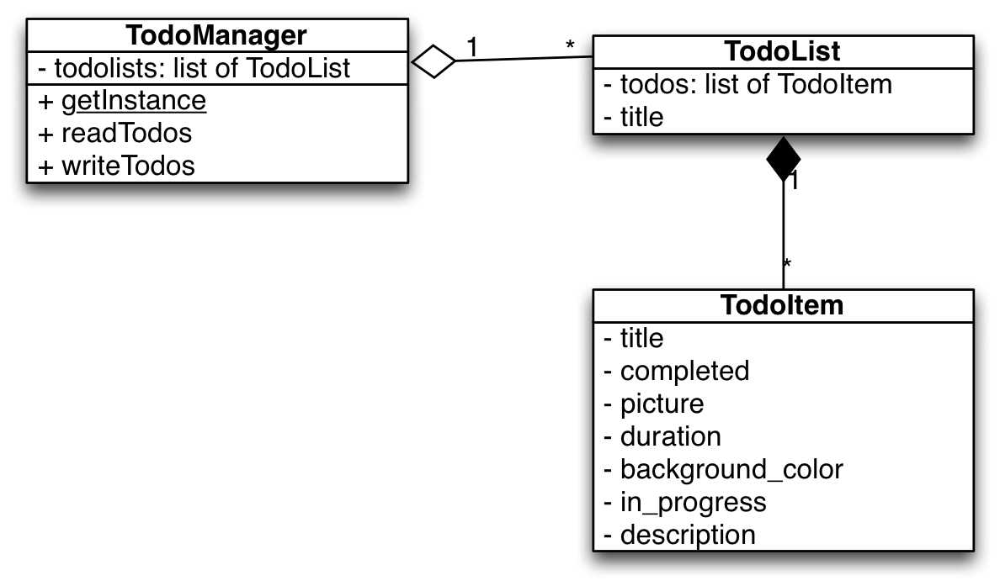

# Many To-Do Lists

*First deadline: Tuesday, 14 March, during class (2 points).*  
*Second deadline: Tuesday, 21 March, during class (1 point).*

## Objectives

- Making your app more complex by introducing multiple lists
- Separate concerns
- Implement a *singleton*

## Preparation

- On Android: read about [Models](/android/models), [State](/android/state) and [Fragments](/android/fragments).
- On iOS: read about [Models](/ios/models) and [State](/ios/state).

## Assessment

Your work on this problem set will be checked for full completion of the assignment and consideration of all requirements. Demo your application during office hours.

All students must ordinarily submit this and all other problem sets to be eligible for a satisfactory grade unless granted an exception in writing by the course's heads.

## ...a lot of things

You now have an application where a user can manage todo items: they can add items and remove them. The structure is still fairly simple, and now it's time to create a 2.0 version of your app. There will be one big new feature: having multiple separate lists of todo items. And this time, we are going to make the code design more object-oriented.

Figure: iOS Master-Detail application

## Requirements

Your task is to build an app according to the description above. On top of that, there are some specific requirements to take into account:

- You will need to add a new screen for showing the different lists that are in the app, as well as a screen for adding a new list.

- You must implement a singleton for managing the lists (see below).

- Every to-do item needs to have *at least* `title` and `completed` fields, additional fields may be implemented as well.

- The user interface should clearly represent whether a todo item has been marked as "done".

- The user must be able to delete items, as well as lists.

- Make sure that the app will always start *exactly* where the user left off in the app (state restoration).

- Your app should support, in a user-friendly way, rotation of the device.

## Getting started

1. Create a new empty GitHub repository.

2. Create a new project, using this pattern as a name: `studentname-pset5`.

# Tips

Most likely, much of your important code now resides in one or more controllers (ViewControllers/Activities). However, if we move some of this code into separate classes, the whole codebase can become more understandable. This is the principle of *separation of concerns*. The "ideal" of this principle is to have each class be responsible for one single thing. In practice, we usually don't take it that far.

Here is a [UML](https://en.wikipedia.org/wiki/Class_diagram) diagram of the classes we think you should make, along with their responsibilities.

- `TodoItem`

    Stores data for a single todo item. This class is very simple and looks a little bit like a `struct` in C. The class variables (such as `title`) should not be `public`, but `private`. Where needed, you can expose the variables through getters and setters.

- `TodoList`

    Stores data for a single todo list. That means that each instance of this class contains many `TodoItem`s! The class variables (such as `title`) should not be `public`, but `private`. Where needed, you can expose the variables through getters and setters.

- `TodoManager`

    A singleton class that groups some common functionality. It contains the list of `TodoList`s for your application, and it has two functions that are reponsible for persistence of the lists between application runs: `readTodos` and `writeTodos`.

Don't forget to use the naming convention of the language that you use. This could be different from the UML diagram.

## How to submit

1. Add a `README.md` with screenshot and a brief description. Use Markdown to format your README, as supported by GitHub. The screenshot must be uploaded to your GitHub repository first! Do that nice and clean in a separate folder called `doc`.

2. Commit and push one last time (hopefully!).

3. Check if your project actually works for other developers! Go to the GitHub webpage for your repository and use the "Download zip" button. Unpack that zip somewhere unusual (your Desktop maybe?) and try to open and run the project.

4. When all is set, paste the GitHub repo URL below, in the textbox!
