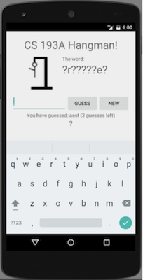

# Hangman

## Objectives

- Practice with model classes.
- Create nice layouts.

## Assignment

Make a basic Hangman game that displays an image of a gallows and a hanging man, along with a word that the player is trying to guess. The word is chosen randomly from a provided dictionary.

At all times the game displays a "clue" of the letters the player has guessed correctly; for example, if the word is "apples" and the player has guessed e, k, p, and t, the clue would be `?pp?e?`. The user can type single-letter guesses into an `EditText`. Display a message such as a `Toast` when the user guesses the word correctly or runs out of guesses and ends the game.

## Requirements

- Use the pictures and dictionary from [this zip archive](hangman-files.zip).

- The EditText allows the user to type multi-letter strings and non-letters; a robust game would handle such attempts gracefully, as well as other errors like trying to guess the same letter twice, etc.

- Put the code for the Hangman game in a separate class. Also create a separate `Dictionary` class that is responsible for loading the dictionary and choosing random words. This class needs **context** to be able to access resources or files. You can create a constructor like this:

        public Dictionary(Context context) {
            this.context = context;
            ... load words ...
        }

    Then in your `MainActivity` create the `Dictionary` like this:

        Dictionary dict = new Dictionary(this.getApplicationContext);

- Keep in mind the assessment criteria!
