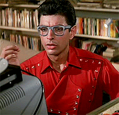
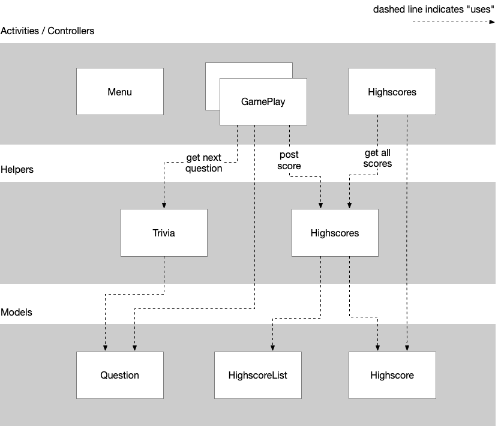

# Trivia

## Objectives

- Create a relatively big app from scratch.
- Create a nice and user-friendly interface.
- Practice with all techniques from earlier assignments.

## Background

Your assignment is to implement a quiz game that presents trivia questions. Interestingly, there are a couple of Trivia Question APIs on the internet, which provide questions and sometimes answers in JSON format. Great for making an app!

When users answer these questions correctly, they should somehow earn points (the algorithm that you use to compute these points is up to you!). After the game has finished, your user should be able to enter their score into a leader board, which will be shared between all users of the app. 

## Game concept

How the game works, how questions are presented, and how input is handled is up to you. Have a look at the questions (see below) to get an idea. Keep it simple though!

Additionally, [this video lecture](https://developer.apple.com/videos/play/design/802/) from Apple may help you (now and in the future) to design your apps with people in mind. The presentation shows some essential ideas on making systems simple and easy to use.

## Getting trivia questions

To get the questions (and answers) needed to build this app, we will make use of the [Open Trivia DB API](https://opentdb.com/api_config.php). As usual, try the API in your browser. Have a look at the JSON results and analyse what kind of data you get and how you might use it in your app.

> Note that you will probably not send one request per Trivia question, but instead, retrieve a whole bunch of questions at the start of a game. It's good practice to not make many requests for a very small amount of information.

## Online storage

To store highscores online you can use the `rester.py` server ([find it on GitHub](https://github.com/stgm/rester)). This is a small Flask application which allows you to post and retrieve any data you want. Again, it uses JSON as the data format, so you can use techniques that you learned earlier to talk to this server.

> Don't have the CS50 IDE yet? It's a nice online development environment! First, make an account on edx.org, then head to cs50.io to open the IDE.

Let's get that server started:

1. In the CS50 IDE, follow the installation instructions from the `rester` README.
2. Try running the server using the command in the README's [usage](https://github.com/stgm/rester#usage) instructions.
3. You can test some of the API in your browser. Try navigating to `/categories` which should yield a list that you might recognize! Then try `/menu`. Don't forget to make your server public as alluded to in the README!
4. Posting new information can't be tested in the browser. Instead, try communicating with the server with `curl`, as documented in the `README`'s [API](https://github.com/stgm/rester#api) section.
5. Try adding items to a list with a different name, and try adding items with a couple of key-value pairs. After posting a new item, check out the resulting list in your browser.

Make sure you know how the server works before starting to work with it from your app!

## Design

Have a look at the diagram below. We defined three types of classes:

- The Activities (Android) / ViewControllers (iOS). These manage the user interface. Most things in the app will happen when someone interacts with buttons, edit fields, lists, etc.
- Helpers. In this app, helpers communicate with servers, package incoming data into model objects and do other useful stuff.
- Models. These are usually very simple classes that contain a little bit of data. Some classes will be like structs, containing a few variables with getters and setters. A class might also be a bit more complex, for example when it is a "list of things".

Some notes:

- We added a Menu controller. If the game is simple, you probably should not make a menu, but instead present the user with a trivia question immediately, so as to entice them to get going!
- We drew multiple GamePlay controllers. In case you are making a full-on trivia app, it might support a few "game modes", e.g. single player versus multiple player. But it's not required, so start small!
- The arrows in the diagram should be read as "uses". For example, the GamePlay controller uses the Trivia helper class, which can provide questions as the game progresses.
- Feel free to change the design of your classes, but we think that the design as presented above is sensible and should help you get started quickly.

> A note about names. On most platforms, classes should hint at what they **are**. That's why on Android, all activities' names end with `Activity`. On iOS, controllers' names end with `ViewController`. Helper classes' names should end with `Helper` or maybe something more specific. Exception to this rule are model classes, which usually have names that purely refer to the "domain" of the app; in this case, things like `Highscore` or `Question`.

## How to get started

Have a look at the diagram and think about which classes you should minimally implement to get a working app. Start with a single activity and only those classes that you need for that activity. If unsure, talk to a teacher! Finally, please make liberal use of instructions for earlier apps in this course.

## Feature ideas

You're on your own for thinking about extra functionality to add to this app!
