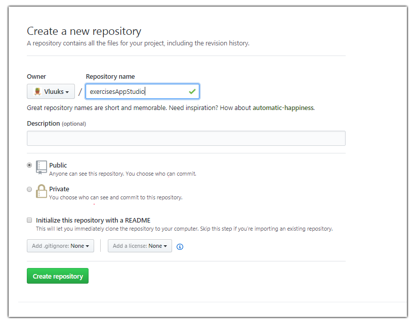
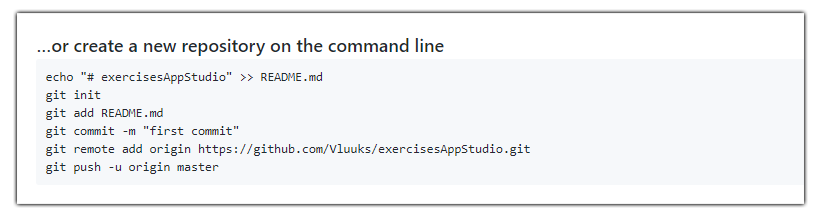

# Exercise Repository

For this course, you are asked to put the code you create during your assignments on GitHub. The guide below provides a possible way to do this. Before you start the guide, make sure you have an account on [GitHub](https://github.com/). You will also need to have installed [Git](https://git-scm.com/download/win) if you are on Windows. If you are using Mac, Git should already be included with your shell environment. If on Linux and Git is not yet present, you can install git on Ubuntu/Debian using `sudo apt install git`. If you have trouble with setup or installation, don't hesitate to speak to an assistant during the labs. 

1. Create a [new repository](https://github.com/new) on GitHub. Make sure that you choose a clear name and that the repository is set to public (otherwise we can't as easily check your submissions). Furthermore, make sure to leave the box for initializing the repository with a readme *unchecked* as per the image below. After you click create, don't close the window yet! 

2. Now that your online repository has been created, it's time to create a local version on your device as well to match it up with the online version! This is where you will save your files, after which you will `push` them to the online repository! Create a folder on your system that you will use to save your exercises, usually `Users/Documents/GitHub` is a logical place to do so but technically it could be anywhere.

3. Now we are going to match this folder up with the online repository you just created. To do this, you need to open the a terminal that supports Git commands (which hopefully came together with the git install!). Luckily, the GitHub website tells us exactly what we have to do!

When you have your terminal open, make sure that you navigate to the folder you created in step 2, as this is the folder that we want to transform into a git repository. When you made your way to that folder, you can copy the commands from the github page and execute them. It may look daunting but nothing really scary is happening. The first line simply says to create a `README.md` in the current directory, and put the contents between the quotes in it. 

Then, with `git init` we tell git that we want this directory to behave as a git repository. Which means we can now perform `add`, `commit` and `push` (and much more) in this directory. Now, becauwe de just created a new file, we want to track it, so we use `git add README.md`. Then, we also want to `commit` it. With commits, it's customary to include a message, so this is what the `-m "first commit"` is for, the `-m` signals that the content between quotes that follows is the commit message. 

Finally, we want to push it, but because pushing is done to the remote version of the repository (our online version on GitHub), we first need to tell git where exactly it should `push` the changes to! This is done with the `git remote add origin` line. Finally, we tell git that we want to push to this remote using `git push -u origin master`. You will probably have to provide your GitHub credentials when doing so, to make sure that it's actually you who is pushing the changes! 

4. Now that you have pushed your changes, your freshly created `README.md` should be visible in your online repository as well, including your commit message! You can now add other files to your local repository folder (probably somewhere in `Users/Documents/GitHub`) and use the `git add`, `git commit` and `git push` to have them show up in your remote repository as well. 

5. You can now submit the link to your repository, which looks like this `https://github.com/YourName/YourRepositoryName` where necessary. 