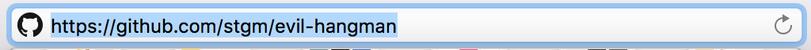

# Writing a proposal

Create a new repository to contain all of your project's documentation and code. For now, add a `README.md` to the root of your repository to contain your proposal document. This document should be formatted in [Markdown]; hence the file extension! The proposal should at least include:

[Markdown]: http://daringfireball.net/projects/markdown/syntax

* your project's title;
* a sentence summarizing your project;
* a bulleted list of features;
* hand-drawn sketches of the complete user experience.

Note: features are [not the same as requirements](http://pmblog.accompa.com/2009/07/13/features-vs-requirements-requirements-management-basics/). Thus, do not simply repeat the list of requirements.

In the submit box below, leave us the URL of your project as per the example:

