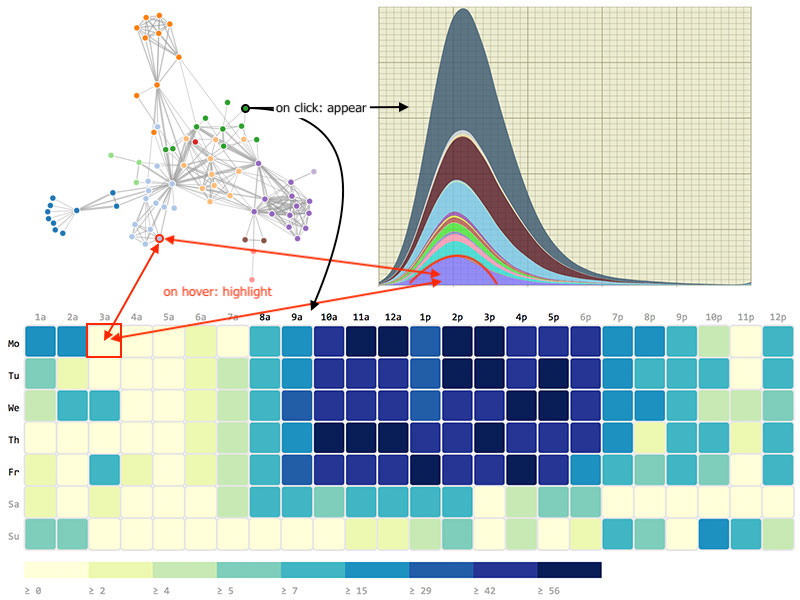

# Project Proposal

Your final project will be based on the platform that you are learning in this course: either Android, iOS or D3/Javascript. To get started with the final project, you'll spend a couple of days building a proposal document. In this document, you'll define what it is that you would like to make and how it connects to a problem in the real world. You may not yet have a clear idea of what you would like to make. In that case, have a look at the [requirements](/project/requirements) which may help you think about good concepts. Also, take note of example visualizations or apps that are presented in your course and think about variations that you might make.

## Goal of the document

You and others can use this document to estimate the effort required to implement the project. Your project may have a high risk of failure if:

- the envisioned project tries to do too much
- the envisioned project doesn't do enough
- the purpose of the project is not well-defined (too vague)

By writing a clear proposal document and getting feedback on it from multiple students and teachers, you can avoid these risks!

## Getting started

The proposal document should be written in Markdown so it can be quickly edited, and because it can then be easily reviewed on GitHub by the staff. To start your project, you should create a new empty Github repository. The document should then be saved in the repository as `README.md`.

Below, we list required aspects of your proposal document.

## Problem statement

Write a statement about the problem that your finished project will solve. The problem[^1] has to be clearly described and very specific. We see two possibilities:

- There is a clearly defined problem that a reasonably large group of people have, which an app or visualization can solve particularly well.
- There is a widespread lack of knowledge or understanding that an interactive visualization is particularly suited to remedy.

In both cases, you should be able to define a target audience who have specific interests that match your project. Include that, too.

In total, keep the problem statement to four or five lines of text.

## Solution

Describe your solution in full detail.

- Summarize your idea in a single sentence, connecting it to the "gap" that you describe.

- Include a **visual sketch** of what the final product will look like for the user; if you envision the application to have multiple screens, sketch these all out separately. Clearly specify the possible user interactions, and include concrete examples of data. Your sketches do not have to be professional-looking, but they have to be complete and neat!

<a href="/course/10%20Milestones/10%20Project%20Proposal/screens-proposal.png" class="thumbnail">

Example sketch for a mobile app
</a>

<a href="/course/10%20Milestones/10%20Project%20Proposal/sketch.jpg" class="thumbnail">

Example sketch for a data visualization
</a>

- Include a list of **main features** that will be available to users. All features should also be visible in the sketch. Keep it brief.

- Split the features into 1) the *minimum viable product* (MVP) and 2) parts that are optional to implement.

    A minimum viable product is the product with as least features as possible, which still helps solve the problem for your target audience. We think it's important to clearly define this, because it defines the *minimum* amount of work that you will have to put into the project.
    
    Other parts of your project may be optional to implement or "nice to have".

## Prerequisites

Describe the things that you'll have to get in order.

- List the **data sources** that you will use and whether you will need to transform the data before it is usable for your application. The list should include links to where the data sources can be found.

- List the **external components** (libraries like `d3-tip` or `SQLite`) that you need to implement certain features. Include the names, and if the component is not standard, include a link to its website.

- Include a review of **similar** mobile apps or related visualizations, in terms of features and technical aspects: what do they do? how have they implemented it? can you do it in the same way?

- Identify the **hardest parts** of implementing your application: think of technical problems or limitations that could arise during development and what possibilities you have to overcome these.

## Sanity check

Before continuing, compare your solution to the [project requirements](/project/requirements) one last time. Also, is it still clear that your proposed project is indeed a solution to the stated problem?

Also, the proposal document should be well-written and clearly formatted. Do not forget to include a
title, your name, and a paragraph summary of the application goals at the top.

Finally, make sure that your document is spell-checked, and that images are not too large or too small (your document will be read in a normal browser via GitHub).

## Submitting

After you have pushed all changes to Github, copy the URL of the GitHub page for your project and submit it below. It will be in this format: <https://github.com/stgm/project>.

Don't commit any code yet! Your repository should be clean for us to read, containing the **README.md**, a **doc** folder (exactly that name), pictures in the **doc** folder, and nothing else.

## What's next

The next step in your project is creating a design document. There, you'll describe how your project will be created according to the rules of the application framework that you're using.

Meanwhile, keep an eye on the **GitHub Issues** for your project. This is where you will get feedback on whether your project is accepted as it is described, or you need to make some changes.

[^1]: *"The problem need not be a pressing societal need, but rather any perceived gap in a situation or experience. For example, the Insalata Caprese is a wonderful artifact, but hardly addresses a problem in the deepest sense of the word. [...] In effect, problem definition is the creation by the designer of an explanation of why the user experiences a gap. This diagnosis can be thought of as an identification of user needs that are not being met in the current state and/or the recognition of criteria for a high-quality solution."*---Karl Ulrich, Design (2011).
