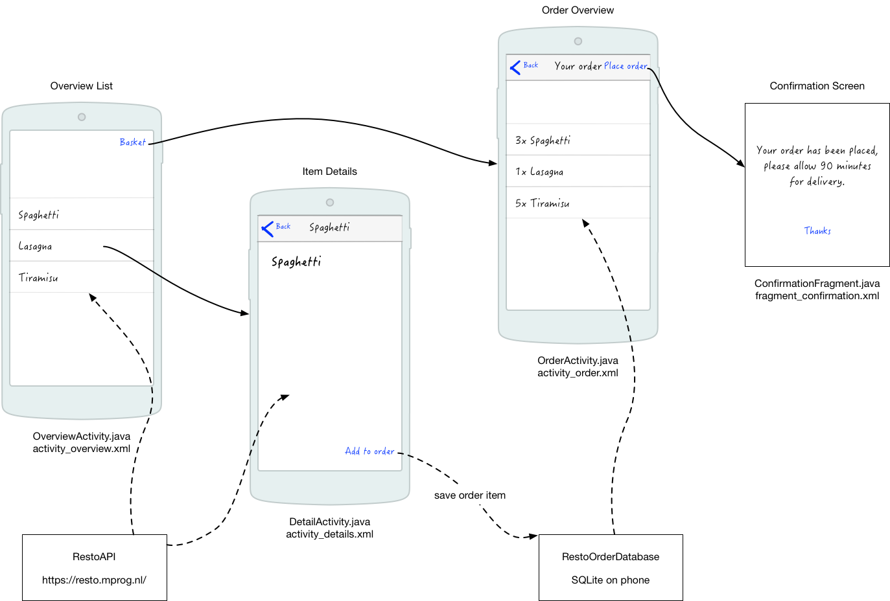
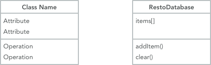

# Design Document

Based on your proposal, you can now start studying your problem in a more
technical fashion. Map the separate parts of the solution onto the framework(s)
that you are using. What APIs, methods or techniques do you need to implement
each feature?

Think about and fully express how the user interface will be
handled, where the data is coming from, and how the various parts will work
together to form a complete application.

The teaching staff and your fellow students can help you spot fundamental
problems that need to be solved, or if technical limitations will likely
prevent you from finishing the project.

> It is expected that you separate, in your code, handling of the user interface from data management and from complex algorithms whenever possible. It should be clear from your design document how you are going to do this!

## Design doc for data visualizations

For this deadline, you must prove that you have access to the data in a usable format!

Some parts that you should describe here:

- a list of data sources if you will get data from an external source, including information on how your are going to filter and transform the data for your project

- a diagram with an overview of the technical components of your app (visualizations, scraper etc etc)

- as well as descriptions of each of the components and what you need to implement these

- a list of APIs or D3 plugins that you will be using to provide
  functionality in your app

## Design doc for mobile apps

Some parts that you should describe here:

- advanced sketches of your UI that clearly explain which features are
  connected to which underlying part of the code (e.g. where the database is accessed and what for)

    

- a diagram of utility modules, classes and functions that you will need to
  implement, in appropriate detail

    

- a list of APIs and frameworks or plugins that you will be using to provide
  functionality in your app

- a list of data sources if you will get data from an external source, including information on how your are going to filter and transform the data for your project

- a list of database tables and fields (and their types) if you will use a database

## Repository

Save your design document as **DESIGN.md** in the root of your existing Project GitHub
repository. Don't forget to update your **README.md** if you have made any
incompatible decisions, and push that file, too!
