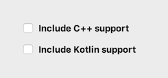
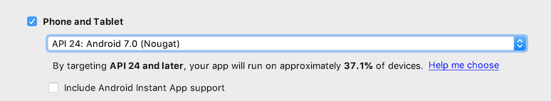
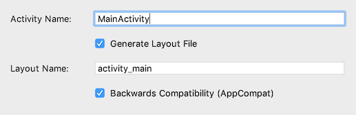
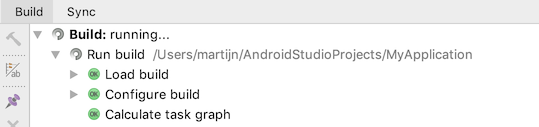
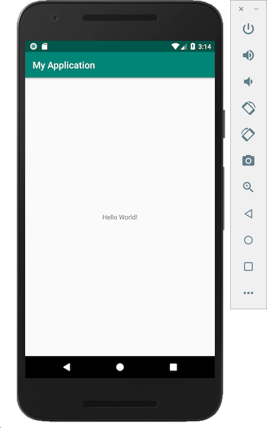

# Android: installation

To develop Android apps, you preferably need an Android phone that is at most a few years old, on which you may test out the apps that you will develop. However, it is also possible to emulate an Android phone on your laptop---although this requires a laptop that is "not slow".

Whatever hardware you have, you can test for yourself whether the development environment is fast enough for you to create an test apps easily. Just follow the instructions below. If you feel that everything is too slow, or something doesn't work, please contact the course's staff immediately to come to a satisfactory solution!

## Installing

Note: downloading from the website is about 1GB, but after that, Android will need to download another GB of stuff to install! Best to download at home, if possible, or else make sure that you have plenty of time left to download at the lab.

- [Download Android Studio](https://developer.android.com/studio/).

- On Windows, run the .exe installer, following the [instructions](https://developer.android.com/studio/install).

- On Mac, open the downloaded .dmg file and drag Android Studio to your Applications folder, following the [instructions](https://developer.android.com/studio/install). Please allow HAXM to install, entering your password when requested! HAXM provides a powerful platform for emulating Android phones.

## Testing

- Launch Android Studio and choose "Start a new Android Studio project".

- On the next screen, do **not** check Kotlin or C++ support!

    

- When asked to select platforms that your app is targeting, choose **Phone and Tablet**. Then choose API level **24**, unless your phone has a slightly lower version of Android installed (and you are unable to upgrade).

    

- Choose to start with an **Empty Activity** and leave the options as is:

    

- Your project will be loaded, but before everything is set, the build system (compiler) has to initialize your project. Only after that is finished, you can proceed to the next step.

    

- Press Run  to try running your (empty) app. You will probably be greeted with an empty screen: .

- If your phone is listed in that screen, you may try running the app on it. If you have connected your phone through USB, but it does not appear, press **Troubleshoot**.

- If your phone will not work or cannot be used for app development, you can install a *Virtual Device*. Press **Create new Virtual Device** and select a modern phone like the Pixel 2 or the Nexus 5X. Click **Next** and select **download** for API level 26 (Oreo). After downloading, finish creating the device.

    Back in the device selection screen ("Select deployment target"), choose the virtual device and press **OK**.

- No need to install "Instant Run"! Testing apps may work better without that feature.

- The device will load and boot up, which will take a while. It will then show the home screen, and after some waiting, your new app will show!

    
