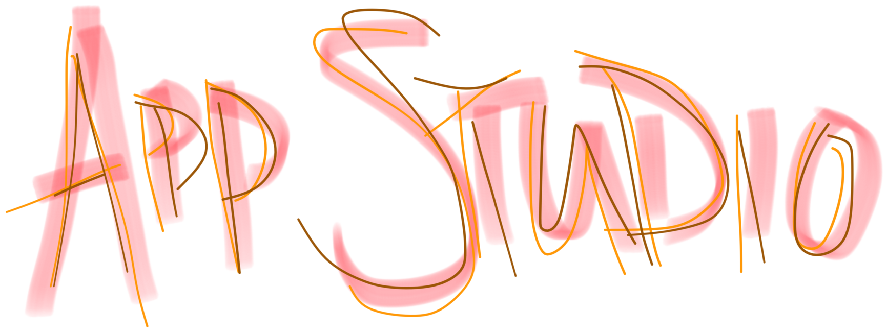

{:style="max-width:400px"}

*Edition: Spring 2016 (still under construction)*

Today's applications are increasingly mobile. Computers are no longer confined
to desks and laps but instead live in our pockets and hands. This course
teaches students how to build mobile apps for Android and iOS, two of today's
most popular platforms, and how to deploy them on Google Play and the App
Store. Students document their work through a series of written and oral
proposals, progress reports, and code. Students learn to write native apps for
Android using Studio and the Android SDK, to write native apps for iPhones,
iPod Touches, and iPads using Xcode and the iOS SDK, and to write web apps for
both platforms.

## Staff

Martijn Stegeman  
*instructor*  
<help@mprog.nl>

Gracia Redder  
*teaching assistant, Android*

Hella Haanstra  
*teaching assistant, Android*

Julian Jansen  
*teaching assistant, iOS*

## Prerequisites

Programming 1 and 2 or equivalent, as decided by the courses' instructors. You
will need to be comfortable with programming, plus have some experience with
memory management, runtime analysis, design patterns, data structures and algorithms. You will
need to have a laptop capable of running Xcode or Android Studio.

## Expectations

* Students wanting to learn iOS programming are encouraged to have a Mac
  (running OS 10.9) as well as an iPad, iPhone, or iPod touch; students wanting
  to learn Android can use any platform that Android Studio runs on and should
  have access to an Android phone or tablet.

* Students are expected to attend all lectures, read all provided materials and
  to submit all required projects, as specified below.
  
* Students are expected to use discussions with the course's instructor and teaching assistants to
  improve the technical and functional designs of all projects.

## Design track

*Only available in the February-March period.*

The first part of this course is the design track, where we'll dive into understanding what good apps are, how we can discover good app concepts and how we can create apps that users are eager to use again and again.

To complete this part of the course, you will need to attend weekly workshop sessions, usually on Mondays at 15:00. Some of the work will be done in class and there is regular sharing of work by way of informal presentations.

Topics by week are:

| week | topic                  | in class           |  
| ---: | ---------------------- | ------------------ |  
|    1 | user research          | introduction       |  
|    2 | introduction to design | affinity analysis  |  
|    3 | affinity analysis      | *no class*         |  
|    4 | use cases              | sketching workshop |  
|    5 | prototyping            | prototype testing  |  
|    6 | design critique        | discussion         |  
|    7 | design critique 2      | discussion         |  

All assignments are released on Mondays and are due by the next Monday, at 13:00. Some of the assignments have to be handed in individually, and other are handed in by a single representative per group.

## Technical track

*Available both in February-March and in April-May.*

The second part of this course is the technical track, where we find ourselves struggling a little bit with the huge iOS and Android platforms. We'll try to understand how these platforms are designed and what parts we should get to know and what parts we can ignore.

This part consists first and foremost of a lot of programming work, done by you! Every student will need to get acquainted with the platform of their choice and create lots of small apps.

Topics by week are:

| week | topic                   |  
| ---: | ----------------------- |  
|    1 | linking views with code |  
|    2 | screen layouts          |  
|    3 | multiple controllers    |  
|    4 | lists and data          |  
|    5 | data persistence        |  
|    6 | object modeling         |  
|    7 | more object modeling    |  

All assignments are released on Mondays and are due by the next Monday, at 13:00. All of these assignments have to be handed in individually, but you are supposed to help other students out generously during the course.

To assist you with programming, there will be an introductory demo every Monday at 13:00 and the lab will be open on Fridays between 13:00 and 17:00.

## Books

- Marko Gargenta and Masumi Nakamura, [*Learning Android*](http://shop.oreilly.com/product/0636920023456.do)
- Steve Derico, [*Introducing iOS 8*](http://shop.oreilly.com/product/0636920034247.do)
